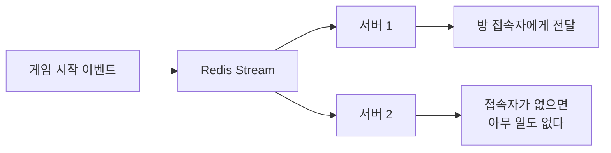
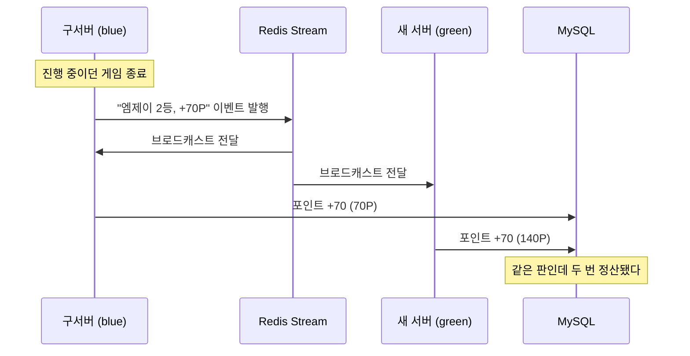
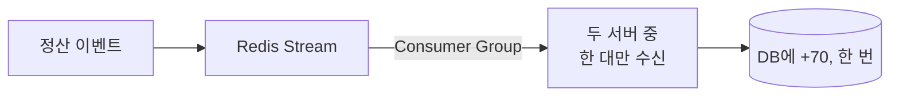
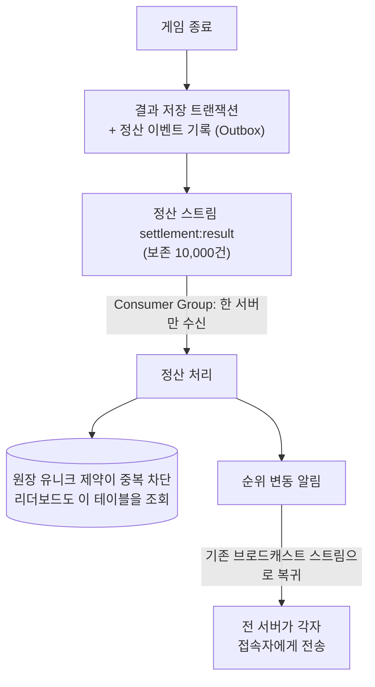

시즌 랭킹 기능을 설계하다가 지금 구조로는 유저 포인트가 두 배로 쌓일 수 있다는 것을 발견했다. 다행히 장애로 겪은 게 아니라 배포 전에 찾았다. 이 글은 그 문제가 왜 생기는지, 어떤 대안들을 비교했는지, 왜 Consumer Group을 선택했는지에 대한 기록이다.

## 문제 상황

시즌 랭킹은 미니게임에서 얻은 등수대로 포인트를 쌓는 기능이다. 1등은 100포인트, 2등은 70포인트를 받고 한 달 동안 누적해 티어와 순위를 매긴다. 정산 단위는 방이 아니라 게임 한 판이다. 한 방에서 게임을 세 판 하면 정산도 세 번 일어난다.

ZZOL의 서버 사이 이벤트 전달은 Redis Stream을 쓰고, 소비는 전부 브로드캐스트다. 이벤트 하나를 모든 서버가 다 받아서 각자 처리한다. 이렇게 한 데에는 이유가 있다. WebSocket 연결은 서버에 붙는데, 이벤트를 발행하는 쪽은 수신자가 어느 서버에 접속해 있는지 모른다. 그래서 모든 서버가 일단 받고 각자 자기 접속자에게만 전달한다. 접속자가 없는 서버에게는 그냥 지나가는 메시지다.



같은 메시지를 두 서버가 받아도 문제가 없는 건 알림이 받아도 부작용이 없는 메시지라서다. 그런데 시즌 포인트는 다르다. 포인트는 DB에 있는 전역 값 하나다. "엠제이가 2등을 해서 70포인트"라는 이벤트를 두 서버가 받으면 둘 다 자기 트랜잭션으로 DB에 70을 더한다. 결과는 140포인트다.

그런데 서버가 두 대인 순간이 정말 있을까? ZZOL은 blue/green 배포를 쓴다. 새 버전을 옆에 미리 띄워두고 트래픽을 한 번에 옮기니 전환 자체는 한순간이다. 하지만 구버전을 바로 죽이지 않는다. 게임 도중에 배포가 나가도 그 판을 끊지 않으려고 구서버에 최대 5분의 유예를 준다([[graceful_shutdown]]에서 정한 값이다). 이 5분 동안 신규 접속은 새 서버로 가고, 구서버는 하던 게임을 마저 진행하고, 게임이 끝나면 정산 이벤트 발행까지 한다. 두 서버가 같은 스트림을 소비하는 시간이 배포마다 최대 5분씩 생긴다.



문제를 정리하면 다음과 같다.

- 배포 후 최대 5분 동안 두 서버가 같은 스트림을 소비한다.
- 정산 이벤트는 서버가 몇 대든 DB에 한 번만 반영되어야 한다.
- 유실도 안 된다. 정산 이벤트가 사라지면 유저가 딴 포인트가 증발한다.
- 기존 알림 이벤트들의 브로드캐스트 동작은 그대로 유지해야 한다.

## 원인

이중 정산이 생기는 이유는 브로드캐스트 소비가 "받은 서버 전부가 처리한다"를 전제로 하기 때문이다.

리스너는 메시지를 받을 때 "이게 내가 처리할 메시지인가"를 판별하지 않는다. 알림처럼 부작용 없는 메시지에는 맞는 전제지만, 전역 상태를 갱신하는 메시지에는 서버 수만큼 중복 반영을 만든다. 정산 이벤트에는 누가 몇 등으로 몇 포인트를 받는지가 전부 들어 있어서, 방 상태가 없는 서버도 DB에 더하는 데 아무 지장이 없다.

따라서 정산 이벤트만큼은 배달 자체가 한 서버에게만 가거나, 여러 서버가 받더라도 결과가 한 번만 반영되어야 한다.

## 해결 방법

### 1. 브로드캐스트 유지 + DB 유니크 제약

정산 원장 테이블에 (게임 세션, 게임 종류, 유저) 유니크 제약을 걸고, 두 번째 정산 시도를 DB가 거부하게 하는 방법이다.

정합성 자체는 지켜진다. 하지만 두 가지 문제가 있다.

첫 번째로 서버 N대 중 N-1대가 매번 받아서 버리는 헛수고를 한다. 모든 정산 이벤트를 전 서버가 수신하고, 처리를 시도하고, 제약에 튕기는 흐름이 평상시에도 반복된다.

두 번째로 정산이 INSERT 하나로 끝나지 않는다. 원장 기록, 포인트 가산, 티어 계산, 랭킹 갱신으로 이어지는 연쇄라서 제약 하나로 전체를 막을 수 없다.

### 2. 브로드캐스트 유지 + 분산 락 + 완료 마킹

ZZOL에는 이미 [[distributed_lock_and_race_condition]]에서 만든 분산 락과 처리 완료 마킹이 있다. 그걸 정산에도 걸어볼 수 있다.

여기서 헷갈리기 쉬운 지점이 있다. 락은 두 서버가 동시에 실행하지 못하게 순서를 만들 뿐, 실행 횟수를 줄이지 못한다. blue가 먼저 70을 더하고 락을 풀면 3초 뒤 green이 락을 잡고 또 70을 더한다. 순서는 완벽하게 지켜졌고 결과는 140포인트다. 그래서 락만으로는 안 되고 "이미 처리했다"는 완료 마킹이 반드시 따라붙는다.

락과 마킹을 합치면 중복은 거의 막힌다. 하지만 여러 번 배달해놓고 한 명만 통과시키는 구조라 락 경합이 상시 발생한다. 더 큰 문제는 마킹은 Redis에, 정산은 MySQL에 쓰는 서로 다른 저장소의 두 쓰기라 하나의 트랜잭션으로 묶을 수 없다는 점이다. 마킹만 하고 죽으면 재전달이 와도 건너뛰어 포인트가 유실되고, 정산만 하고 죽으면 재전달 때 또 더해져 중복이 생긴다. 죽는 타이밍에 따라 유실과 중복 중 하나가 남는다.

### 3. 외부 브로커 도입

RabbitMQ나 Kafka를 들이면 작업 큐 소비는 기본 기능이다. 하지만 [[message_recovery]]에서 이미 같은 결론을 내린 적이 있다. 기능 하나를 위해 인프라를 늘리는 선택은 그때도 지금도 과하다.

### 4. Redis Stream Consumer Group (선택한 방법)

Redis Stream에는 브로드캐스트와 반대 성격의 소비 모델이 이미 있다. Consumer Group이다. 그룹에 속한 소비자 중 한 명에게만 메시지를 나눠주는 작업 큐 방식으로, 방송보다는 택배에 가깝다.



사실 Consumer Group은 예전에 검토했다가 쓰지 않기로 한 기술이다. 당시 이유는 세 가지였다. 단일 인스턴스라 나눠 읽을 상대가 없고, 발행 보장은 [[outbox_pattern]]으로 충분하고, 스트림이 최근 100건만 남겨서 재전달 장치를 만들어봐야 회수할 메시지가 없었다.

이번 문제에서는 세 이유가 하나도 유효하지 않다. blue/green의 5분 창은 멀티 인스턴스 상황 그 자체다. 알림과 달리 포인트는 소비까지 보장되어야 한다. 보존 개수는 스트림마다 다르게 잡으면 된다.

## 선택한 근거

이 방법을 선택한 이유는 근본 원인을 배달 계층에서 제거하기 때문이다.

방법 1과 2는 배달을 N번 해놓고 N-1번을 걸러낸다. 근본 원인이 "여러 번 배달"이라면 배달 자체를 한 번으로 줄이는 게 맞다. Consumer Group은 그 분배를 Redis가 대신해준다. 누가 처리할지 고르는 것, 처리하던 서버가 죽으면 다른 서버가 이어받는 것, 어느 메시지가 아직 미완료인지 기억하는 것까지 전부 Redis의 기본 기능이다. 직접 만들면 전부 앱 코드로 풀어야 하는 분배 문제다.

이 구조는 다음과 같은 장점이 있다.

- 평상시 중복 배달이 사라진다. N-1대의 헛수고와 락 경합이 없다.
- 처리하던 서버가 죽어도 메시지가 미완료 목록(PEL)에 남아 다른 서버가 회수한다. 유실 방지 요구까지 같이 풀린다.
- 새 인프라가 없다. 이미 쓰고 있는 Redis Stream 위에서 소비 모델만 바꾼다.
- 기존 알림 스트림은 건드리지 않는다. 정산 스트림 하나만 작업 큐로 소비한다.

다만 Consumer Group도 중복을 완전히 없애지는 못한다. 처리 완료 응답(ACK)을 보내기 직전에 서버가 죽으면 같은 메시지가 다시 온다. 그래서 최종 구조는 이중 방어다. Consumer Group이 평상시의 중복 배달을 없애고, 정산 원장의 유니크 제약이 장애 시의 재전달을 무해하게 만든다. 방법 1을 버린 게 아니라 최후 방어선으로 자리를 옮긴 셈이다.

## 어떻게 코드가 변경되었나?

### 코드 변경

정산 이벤트의 ID를 랜덤 UUID가 아니라 판에서 파생시켰다. blue와 green이 같은 게임 종료를 각자 발행해도 같은 ID가 나와야 "같은 정산인지"를 판별할 수 있다.

```java
// 어느 서버가 언제 만들어도 같은 판이면 같은 ID다
String eventId = "settlement:" + roomSessionId + ":" + miniGameType;
```

소비 쪽은 처리 결과에 따라 ACK를 다르게 보낸다. 성공해야만 완료 응답을 보내고, 실패하면 PEL에 남겨 재처리 기회를 지킨다.

```java
try {
    processor.process(record);
    acknowledge(record);        // 성공했을 때만 완료 응답을 보낸다
} catch (PoisonMessageException e) {
    deadLetterPublisher.publish(record, e.getMessage());
    acknowledge(record);        // 영원히 실패할 메시지는 격리하고 끝낸다
} catch (Exception e) {
    // ACK하지 않는다. PEL에 남아 회수 대상이 된다
}
```

### 구조 변경



- 발행은 기존 Outbox 경로를 그대로 탄다. 결과 저장과 이벤트 기록이 한 트랜잭션이다.
- 회수 스케줄러가 30초마다 PEL을 확인해서, 60초 넘게 방치된 메시지의 소유권을 가져와 재처리한다. 배포로 사라진 구서버가 가져갔던 메시지가 대표적인 회수 대상이다.
- 다섯 번 실패한 메시지는 DB 테이블에 격리하고 사람이 본다. 형식이 깨진 메시지를 방치하면 회수 스케줄러가 영원히 되돌리는 무한 루프가 되기 때문이다.
- 정산 스트림만 보존을 10,000건으로 잡았다. 미처리 메시지가 잘려나가면 PEL에 항목이 남아 있어도 회수해 온 본문이 빈 껍데기라서, 처리 보장이 목적인 스트림은 보존 개수부터 달라야 한다.
- 관측은 [[zzol_metric_improvement]]에서 못 썼던 XPENDING이 이제 진짜 지표가 됐다. 배달됐는데 완료되지 않은 수(pending), 아직 배달조차 안 된 수(lag), 격리된 수를 게이지로 노출한다.

흐름의 마지막이 재미있는 지점이다. 정산이 끝난 뒤의 순위 변동 알림은 다시 브로드캐스트 스트림으로 돌려보낸다. 한 코드베이스 안에 방송과 작업 큐가 공존하고, 이벤트가 자기 성격에 맞는 소비 모델을 골라 탄다.

## 설계 선택에 대한 의문

### Listener에서 내 방인지 확인하고 처리하면 되는 것 아닌가?

> 배포 중이어도 구서버 방은 구서버가, 새 방은 새 서버가 맡잖아요. 그냥 내 방 이벤트만 골라서 처리하면 되는 거 아니에요?

방이 섞이지 않는 것은 맞다. 하지만 두 가지가 걸린다.

우선 "내 방"을 판별할 기준이 없다. 방이 내 메모리에 있는지로 가르면 될 것 같지만, 방 생성 이벤트도 브로드캐스트라서 전환 후 만들어진 방의 복제본이 구서버 메모리에도 생긴다. 복제본이 있다는 것과 소유한다는 것은 다른 문제다.

그리고 판별 기준을 만든다는 건 "이 메시지를 누가 처리할 것인가"라는 분배 문제를 앱 코드로 직접 푸는 것이다. 소유자가 죽으면 누가 이어받는지, 아무도 자기 것이 아니라고 판단해서 유실되는 틈은 어떻게 막는지가 전부 따라온다. 이 분배 문제를 Redis가 이미 풀어둔 게 Consumer Group이다.

### Consumer Group을 썼는데 유니크 제약이 왜 또 필요한가?

> 한 서버만 받는다면서요. 이중 방어는 과한 거 아니에요?

Consumer Group의 전달 보장은 at-least-once다. 최소 한 번은 전달하지만 정확히 한 번은 보장하지 않는다. 정산을 DB에 커밋하고 ACK를 보내기 직전에 서버가 죽으면, Redis 입장에서는 미완료라서 같은 메시지를 다시 배달한다.

그래서 역할이 나뉜다. Consumer Group은 중복 배달의 빈도를 줄이는 장치고, 유니크 제약은 그래도 새어 들어온 중복을 무해하게 만드는 장치다. 하나가 다른 하나를 대체하지 않는다. 예전에 Consumer Group을 검토하며 "그룹을 써도 멱등은 별도로 필요하다"고 적어둔 문장이 그대로 이번 설계의 뼈대가 됐다.

## 검증

구현 후 다음 내용을 검증했다.

- 통합 테스트는 발행부터 Consumer Group 소비, 멱등 정산, ACK까지 실제 Redis·MySQL로 관통한다. 처리 후 PEL이 비어 있는 것까지 확인해 완료 응답이 확정됐음을 검증한다.
- 단위 테스트는 ACK 3분기(성공, 영구 실패 격리, 일시 실패 보류), 회수 스케줄러의 소유권 이전, 다섯 번 실패 후 격리, 재전달된 이벤트 건너뛰기, 시즌 경계를 넘긴 재처리를 각각 고정한다.
- 로컬에서 서버와 프론트를 전부 띄우고 실제로 게임을 플레이해서, 정산 이벤트가 그룹으로 소비되고 원장과 랭킹에 반영되는 것을 눈으로 확인했다.

테스트가 잡지 못한 것도 하나 있었다. 그룹이 사라졌을 때(NOGROUP)의 자가 복구 로직이 사실 죽어 있었다. Spring이 Lettuce 예외를 감싸면 최상위 메시지에 NOGROUP이라는 단어가 없어 복구 조건이 매칭되지 않았고, 복구 대신 에러 로그가 폴링마다 쌓여 통합 테스트 결과 파일이 177MB까지 부풀고 나서야 발견했다. 테스트 셋업이 그룹을 직접 만들어준 덕분에 버그가 가려져 있었다. 예외의 원인 체인 전체를 검사하도록 고쳤다.

## 트레이드오프

- PEL 관리, 회수 스케줄러, 격리 테이블처럼 운영에서 새로 신경 써야 할 것들이 생겼다. 예전에 "관리 오버헤드가 과하다"며 미뤘던 바로 그것들인데, 이 기능에서는 오버헤드가 아니라 처리 보장의 본체다.
- at-least-once라서 멱등 처리는 여전히 별도로 필요하다. Consumer Group이 멱등을 대신해주지 않는다.
- blue/green 교체로 사라진 서버의 컨슈머 등록이 그룹에 남는다. 회수가 동작해서 기능에는 지장이 없지만 관측 지표에 노이즈가 낀다. 정리는 후속 작업으로 남겼다.
- 컨슈머가 서버당 하나라 같은 회원의 결과 두 건이 서로 다른 서버에 배달되면 처리 순서가 어긋날 수 있다. 현재 정산은 가산이라 순서와 무관하지만, 연승처럼 순서에 민감한 값을 넣을 때는 회원별 라우팅을 다시 검토해야 한다.

## 결과

이번 변경의 핵심은 Consumer Group을 적용한 것이 아니라, 같은 스트림 인프라 위에서 이벤트의 성격에 따라 소비 모델을 분리한 것이다.

기존에는 모든 이벤트가 브로드캐스트 하나로 소비됐고, 그 전제가 맞는 동안은 문제가 없었다. 전역 상태를 갱신하는 이벤트가 처음 등장하면서 전제가 깨졌고, 대안들을 비교한 결과가 Consumer Group이었다.

이 구조를 통해 다음과 같은 효과를 얻었다.

- 배포 중 두 서버가 겹치는 5분 동안에도 포인트는 한 번만 정산된다.
- 처리하던 서버가 죽어도 메시지가 유실되지 않고 다른 서버가 이어받는다.
- 알림은 방송으로, 정산은 작업 큐로 - 각 이벤트가 자기 성격에 맞는 소비 모델을 탄다.
- 미완료·격리 메시지 수가 근사치가 아니라 Redis가 직접 알려주는 지표로 관측된다.

결과적으로 브로드캐스트는 여전히 ZZOL 실시간 알림의 기본 소비 모델이고, 정산 스트림 하나만 작업 큐로 소비한다. 둘 중 어느 쪽이 더 좋은 기술인 게 아니라, 이벤트의 성격에 따라 맞는 소비 방식이 다를 뿐이다.

이제 게임이 한창일 때 배포가 나가도 포인트 걱정은 하지 않아도 된다.
