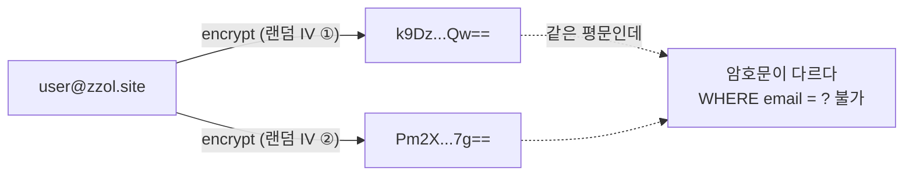
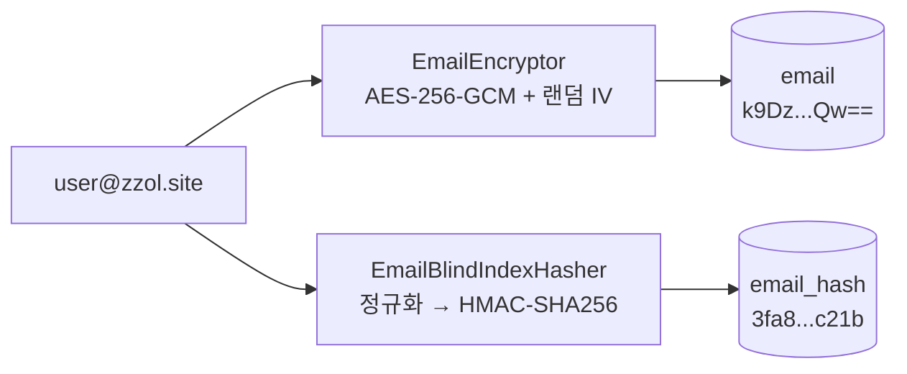
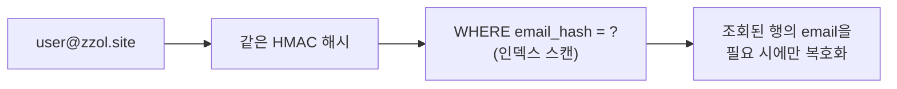

요즘 보안사고 뉴스가 끊이지 않는다. SK텔레콤에서 2,324만 명의 USIM 정보가(2025년 4월), 롯데카드에서 297만 명의 카드정보가(8월), 쿠팡에서 3,370만 건의 개인정보가(11월) 유출됐고, 바로 지난달에는 티빙에서 약 1,900만 명의 회원 정보가 빠져나갔다. 뉴스를 보다가 ZZOL의 DB를 다시 봤다. OAuth 로그인을 도입하면서 `oauth_account` 테이블에 이메일을 **평문으로** 저장하고 있었다. 우리 DB가 저렇게 털리면 유저의 이메일이 그대로 나간다. 이 글에서는 이메일을 암호화하되 조회는 계속 가능하게 만든 과정을 기록한다.

## 왜 지금 암호화인가

사고 뉴스를 그냥 넘기지 않고 사건별로 뜯어봤다. 세 가지가 눈에 들어왔다.

첫째, **평문 저장은 유출을 참사로 만든다.** SK텔레콤 사건에서 가장 충격적이었던 건 유출 규모가 아니라 USIM 인증 키 2,610만 개가 **암호화 없이 평문으로** 저장되어 있었다는 사실이다. 털린 순간 그대로 쓸 수 있는 데이터가 나간 것이다. 유출 자체는 완전히 막을 수 없어도 유출된 데이터가 읽히는 것은 막을 수 있었다.

둘째, **암호화는 뚫린 뒤에도 실제로 작동한다.** 티빙 사건의 유출 항목을 보면 이름, 생년월일, CI/DI는 평문으로 나갔지만 **암호화해뒀던 필드(이메일의 ID 부분, 환불 계좌번호, 비밀번호)는 원문 노출이 제한됐다.** 같은 DB가 털렸는데 암호화 여부가 필드별 피해 크기를 갈랐다. "어차피 털리면 끝"이 아니라는 실증이다.

셋째, **접근 통제는 단일 방어선이 될 수 없다.** 쿠팡 사건의 범인은 외부 해커가 아니라 보안 키 관리 업무를 맡았던 전직 내부 직원이었다. 접근 권한이 있던 사람 앞에서 "DB 접근을 잘 통제하면 된다"는 방어선은 무력하다.

ZZOL의 상황을 점검해봤다. OAuth 로그인을 도입하면서 provider가 주는 이메일을 `oauth_account`에 저장하기 시작했다. 방어선은 "DB에 접근하지 못하게 한다" 하나뿐이었다. SQL 인젝션이 아니어도 백업 파일, 잘못 노출된 덤프, 쿠팡이 보여준 내부자까지 DB가 유출되는 경로는 다양하다. 목표를 이렇게 잡았다.

> **DB가 통째로 유출되어도, 이메일 원문은 노출되지 않아야 한다.**

## 문제: 암호화하면 조회가 안 된다

암호화 자체는 어렵지 않다. AES-256-GCM으로 암호화해서 저장하면 된다. 문제는 그 다음이다.

ZZOL에서 이메일 컬럼의 요구사항은 두 가지다.

첫째, **원본을 복원할 수 있어야 한다.** 어드민에서 CS 대응할 때 이메일을 확인해야 하고, 향후 이메일 발송에도 원문이 필요하다. 비밀번호처럼 단방향 해시로 밀어버릴 수 없다.

둘째, **동등 조회가 가능해야 한다.** OAuth 로그인이 들어올 때마다 "이 이메일을 가진 계정이 이미 있는가"를 `WHERE email = ?`로 조회한다. 로그인 경로의 핵심 쿼리다.

그런데 AES-GCM은 암호화할 때마다 IV(Initialization Vector, 초기화 벡터)라는 값을 새로 뽑아서 섞는다. IV는 쉽게 말해 "같은 평문이라도 매번 다른 암호문이 나오게 만드는 랜덤 시작값"이다. 그래서 **같은 이메일을 두 번 암호화하면 암호문이 매번 다르다.** 이건 버그가 아니라 암호학적으로 올바른 동작이다. 같은 평문이 같은 암호문이 되면 암호문만 보고 "이 두 행은 같은 이메일이다"라는 패턴이 노출되기 때문이다.

올바르게 암호화할수록 조회가 불가능해진다. 이 문제를 푸는 게 이번 작업의 핵심이었다.



## 대안 비교

**대안 1 - IV를 고정해 결정적으로 암호화한다.** IV를 고정하면 같은 평문은 항상 같은 암호문이 되므로 동등 조회가 가능해진다. 하지만 GCM에서 IV 재사용은 알려진 최악의 안티패턴이다. 같은 키에 같은 IV로 여러 평문을 암호화하면 내부에서 쓰는 난수열이 그대로 반복된다. 이러면 두 암호문을 겹쳐 비교하는 것만으로 평문 사이의 관계가 드러나고 변조를 막아주는 검증 기능까지 무력화된다. 암호화를 하는 의미 자체가 사라져서 탈락시켰다.

**대안 2 - 전체를 조회한 뒤 애플리케이션에서 복호화해 매칭한다.** 계정 전체를 읽어와서 하나씩 복호화하며 비교하는 방식이다. 계정이 N건이면 로그인 한 번에 N번의 복호화가 발생하고, 인덱스가 무용지물이 된다. 서비스에서 가장 빈번한 경로 중 하나인 로그인에 이 비용을 태울 수는 없어서 탈락시켰다.

**대안 3 - DB 함수(`AES_ENCRYPT`)로 암호화한다.** MySQL 내장 함수로 암호화하는 방식이다. 쿼리 문자열에 암호화 키가 그대로 들어간다. 슬로우 쿼리 로그, `processlist`, APM 어디에든 키가 노출될 수 있다는 뜻이다. 유출 대비로 암호화를 하는데 키가 로그로 새는 구조는 본말전도라서 탈락시켰다.

**대안 4 - 가역 암호화와 블라인드 인덱스로 이원화한다.** 최종 채택안이다.

핵심 아이디어는 **"원본 보관"과 "동등 조회"라는 두 책임을 컬럼 두 개로 분리**하는 것이다.

| 컬럼 | 값 | 방식 | 책임 |
|---|---|---|---|
| `email` | 암호문 (매번 다름) | AES-256-GCM + 랜덤 IV | 원본 보관, 필요 시 복호화 |
| `email_hash` | 결정적 해시 (항상 같음) | HMAC-SHA256 | `WHERE email_hash = ?` 동등 조회 |

같은 이메일은 항상 같은 해시를 내므로 조회는 `email_hash`로 하고, 원문이 필요할 때만 `email`을 복호화한다. 이 검색용 결정적 해시 컬럼을 **블라인드 인덱스(blind index)**라고 부른다.

물론 이 방식도 공짜는 아니다. 단점을 세 가지 감수했다.

첫째, **동등성 패턴은 여전히 노출된다.** 같은 이메일은 항상 같은 해시를 내므로 DB를 손에 넣은 공격자가 "이 두 행은 같은 이메일이다"라는 것까지는 알 수 있다. 대안 1을 탈락시킨 이유 중 하나가 채택안에도 남는 셈이다. 차이는 그 다음이다. 대안 1은 패턴 노출에 더해 암호문 자체가 무너지지만 블라인드 인덱스는 키가 없는 한 원문을 복원할 수 없다. `WHERE email = ?`가 요구사항인 이상 동등성 노출은 피할 수 없는 최소 비용이라고 판단했다.

둘째, **동등 조회만 가능하다.** 해시는 원문의 형태를 완전히 잃어버리므로 `LIKE` 부분 검색이나 정렬은 불가능하다. 지금 이메일 조회는 "이 이메일로 가입한 계정이 있는가" 하나뿐이라 감수할 수 있었다.

셋째, **관리 포인트가 늘어난다.** 컬럼도 2개, 키도 2개다. `email`과 `email_hash`가 한쪽만 채워지면 조회 계약이 깨지므로 두 컬럼의 정합성도 챙겨야 한다.

이 비용을 다 더해도 요구사항 두 개(원본 복원, 동등 조회)를 모두 만족하면서 유출까지 버티는 건 이 구조뿐이었다고 생각했다.

### 왜 그냥 SHA-256이 아니라 HMAC인가

블라인드 인덱스를 만들 때 "그냥 SHA-256으로 해시하면 되지 않나?"라는 생각이 먼저 들었다. 하지만 이메일은 엔트로피가 낮은 데이터라 그냥 해시하면 원문이 사실상 역산되기 때문에 안 된다.

비밀번호와 달리 이메일은 형식이 뻔하고, 유출된 이메일 리스트가 세상에 넘쳐난다. 공격자가 DB를 털었을 때 `email_hash`가 솔트(salt) 없는 SHA-256이라면, 가진 이메일 후보 리스트를 전부 해시해서 대조하는 사전 공격으로 사실상 역산이 끝난다. 해시했지만 안 한 것과 같다.

HMAC-SHA256은 **비밀 키**가 들어간다. 키를 모르면 후보 이메일이 있어도 해시를 만들어볼 수 없으므로 사전 공격이 차단된다. DB가 유출되어도 HMAC 키가 함께 유출되지 않는 한 `email_hash`는 의미 없는 문자열이다. 그래서 암호화 키와 HMAC 키를 **별도 환경변수 2개로 분리**했다. 한쪽 키가 유출되어도 다른 쪽은 지켜진다.

## 구현

전체 흐름은 이렇다. 저장할 때는 이메일 하나가 암호문과 해시 두 갈래로 갈라져 들어간다.



조회할 때는 입력받은 이메일을 같은 방식으로 해시해서 `email_hash`로 찾는다.



### 암호화기 - 저장 포맷에 IV를 함께 담는다

```java
public String encrypt(String plaintext) {
    final byte[] iv = new byte[12];
    secureRandom.nextBytes(iv);                       // 매번 새 IV

    final Cipher cipher = Cipher.getInstance("AES/GCM/NoPadding");
    cipher.init(Cipher.ENCRYPT_MODE, secretKey, new GCMParameterSpec(128, iv));
    final byte[] cipherText = cipher.doFinal(plaintext.getBytes(UTF_8));

    // Base64( IV(12바이트) || ciphertext + GCM tag )
    return Base64.getEncoder().encodeToString(concat(iv, cipherText));
}
```

IV는 비밀이 아니다. "같은 IV를 재사용하지 않는 것"이 중요할 뿐이라 암호문 앞에 붙여서 같이 저장한다. 복호화할 때 앞 12바이트를 떼어 IV로 쓴다. 그리고 GCM은 변조 여부를 검증하는 값(인증 태그)을 암호문에 함께 붙이기 때문에 암호문이 1비트라도 바뀌면 복호화 자체가 실패한다. 유출뿐 아니라 변조도 감지된다.

### 블라인드 인덱스 - 정규화가 먼저다

```java
public String hash(String email) {
    final String normalized = email.trim().toLowerCase(Locale.ROOT);  // 정규화 먼저

    final Mac mac = Mac.getInstance("HmacSHA256");
    mac.init(hmacKey);
    return HexFormat.of().formatHex(mac.doFinal(normalized.getBytes(UTF_8)));
}
```

해시 전에 `trim().toLowerCase()` 정규화를 반드시 거친다. `User@zzol.site`와 `user@zzol.site`는 같은 이메일인데 정규화 없이 해시하면 다른 해시가 나와서 "이미 가입된 계정"을 못 찾는다. 결정적 해시는 입력 정규화까지 해야 완성된다.

### JPA 컨버터 - 도메인 코드는 모른다

암·복호화를 서비스 코드 곳곳에 흩뿌리고 싶지 않았다. JPA의 `AttributeConverter`를 쓰면 엔티티 필드 선언 하나로 저장 시 암호화, 조회 시 복호화가 투명하게 일어난다.

```java
@Convert(converter = EmailEncryptConverter.class)
@Column(length = 512)                 // 암호문 Base64 수용을 위해 확대
private String email;

@Column(name = "email_hash", length = 64)
private String emailHash;             // 저장 시 hasher.hash(email) 세팅
```

도메인과 서비스 계층은 이메일이 암호화되는지조차 모른다. 조회 경로만 `findByEmailHash(hasher.hash(email))`로 바뀌었다.

`email_hash` 인덱스는 **non-unique**로 잡았다. 같은 사람이 카카오와 네이버에 같은 이메일로 가입하면 provider가 다른 두 행이 같은 해시를 갖는 게 정상이기 때문이다.

## 구현하며 마주친 문제들

### 1. 배포하는 순간 기존 유저가 로그인이 안 된다

컨버터를 적용하고 배포하면 어떻게 될까. 새로 저장되는 이메일은 암호문으로 들어간다. 그런데 **기존에 평문으로 저장된 행**을 JPA로 읽는 순간, 컨버터가 평문을 암호문인 줄 알고 복호화를 시도하다가 실패한다. 기존 유저 전원이 로그인 불가가 되는 것이다.

기존 평문 데이터를 배포 시점에 일괄 전환하는 백필(backfill)이 필요했다. 여기서 Flyway가 **앱 기동 전에** 실행된다는 점을 이용했다. 마이그레이션이 평문 행을 모두 암호문+해시로 바꿔놓은 뒤에 앱이 뜨므로 "컨버터는 있는데 데이터는 평문"인 구간 자체가 존재하지 않는다.

문제는 AES와 HMAC 연산을 SQL로 할 수 없다는 것이다. 그래서 SQL 마이그레이션이 아니라 **Java 마이그레이션**(`BaseJavaMigration`)으로 작성했다.

```java
public class V34__backfill_oauth_email extends BaseJavaMigration {

    // email_hash IS NULL 대상만 처리 → 재실행해도 안전(멱등)
    private static final String SELECT_PLAINTEXT =
            "SELECT id, email FROM oauth_account WHERE email_hash IS NULL AND email IS NOT NULL";

    @Override
    public void migrate(Context context) throws Exception {
        // 앱과 동일한 환경변수에서 키를 읽어 암호화 + 해시 백필
    }
}
```

`email_hash IS NULL`인 행만 처리하므로 마이그레이션이 중간에 끊겨 재실행되어도 안전하다. 백필류 마이그레이션은 멱등이 기본값이어야 한다.

### 2. 검증이 있는 줄 알았는데 우회되고 있었다

키 설정 프로퍼티에는 `@Size(min = 32)` 검증을 걸어뒀다. 짧은 키로 서비스가 뜨는 걸 막기 위해서다. 그런데 백필 마이그레이션을 작성하다가 깨달았다. **`@Size` 검증은 Spring이 프로퍼티를 바인딩할 때만 동작한다.** 마이그레이션은 Spring 컨텍스트 밖에서 환경변수를 직접 읽어 객체를 생성하므로 검증이 조용히 우회된다.

최악의 시나리오는 이렇다. 환경변수에 실수로 8자짜리 키가 들어간 상태로 배포되면 마이그레이션이 약한 키로 전체 이메일을 백필한다. 앱은 기동 시점에 `@Size` 검증이 실패해서 뜨지 못하지만 **데이터는 이미 약한 키로 암호화된 뒤다.** 그래서 마이그레이션 안에서 키 길이를 직접 검증해서 약한 키면 백필 전에 실패하도록 했다. 프레임워크가 주는 검증은 프레임워크의 실행 경로 안에서만 유효하다. 그 경계 밖에서 같은 코드를 쓸 때는 검증을 직접 챙겨야 한다.

## 정리

|  | Before | After |
|---|---|---|
| 저장 | 평문 | AES-256-GCM 암호문 (매번 다른 IV) |
| 조회 | `WHERE email = ?` | `WHERE email_hash = ?` (HMAC 블라인드 인덱스) |
| DB 유출 시 | 이메일 원문 노출 | 키 없이는 원문·해시 모두 무의미 |
| 기존 데이터 | — | Flyway Java 마이그레이션으로 멱등 백필 |

## 느낀점

암호화 알고리즘을 고르는 데는 오래 걸리지 않았다. AES-256-GCM과 HMAC-SHA256은 검증된 표준이고 선택지랄 것도 별로 없다. 진짜 일은 그 다음, **이미 돌아가는 시스템에 암호화를 넣는 일**이었다. 기존 평문 데이터를 어떻게 전환할지, 전환 중에 로그인이 깨지지 않을지, 키가 약하면 어디서 막을지 같은 고민이 작업 시간의 대부분을 가져갔다. 알고리즘이 아니라 마이그레이션과 경계 조건이 본론이었다.

세 사건이 가리키는 방향은 결국 같았다. 쿠팡은 접근 통제만으로는 부족하다는 것을, SKT는 평문 저장이 유출을 참사로 만든다는 것을, 티빙은 암호화가 뚫린 뒤에도 작동한다는 걸 보여줬다. 암호화는 "뚫리지 않게 한다"가 아니라 "뚫려도 읽을 수 없게 한다"는 두 번째 방어선이다. [[zzolbot]]에서 이메일을 LLM에 넘기기 전에 토큰화했던 것과 같은 의도다. 개인정보는 저장할 때도 외부로 나갈 때도 원문이 경계를 넘지 않게 한다.

남은 과제는 키 로테이션이다. 지금 구조는 키가 유출되면 전체 재암호화가 필요하다. 다음 단계로는 암호문 앞에 키 버전을 붙여두어 구키·신키를 공존시키며 점진적으로 로테이션할 수 있는 방향으로 검토 중이다.

## 참고자료

- [2025년 한국 데이터 유출 사건 총정리 - NordVPN](https://nordvpn.com/ko/blog/data-breach-incidents-2025/) - SKT 2,324만 명·평문 인증 키, 롯데카드 297만 명
- [2025 대한민국 사이버보안 결산 - 데일리시큐](https://www.dailysecu.com/news/articleView.html?idxno=203952)
- [쿠팡 개인정보 대규모 유출 사건 - 나무위키](https://namu.wiki/w/%EC%BF%A0%ED%8C%A1%20%EA%B0%9C%EC%9D%B8%EC%A0%95%EB%B3%B4%20%EB%8C%80%EA%B7%9C%EB%AA%A8%20%EC%9C%A0%EC%B6%9C%20%EC%82%AC%EA%B1%B4)
- [TVING 개인정보 유출 사건 - 나무위키](https://namu.wiki/w/TVING%20%EA%B0%9C%EC%9D%B8%EC%A0%95%EB%B3%B4%20%EC%9C%A0%EC%B6%9C%20%EC%82%AC%EA%B1%B4) - 유출 항목별 암호화 여부
- [티빙 개인정보 유출, 확인 방법부터 대응까지 - 다이어리포인트](https://www.diarypoint.com/news/articleView.html?idxno=4394)
