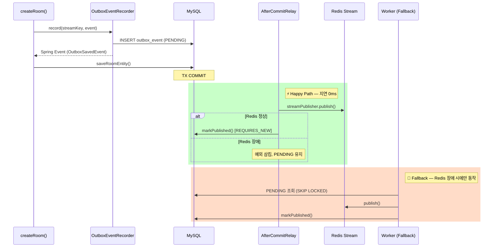
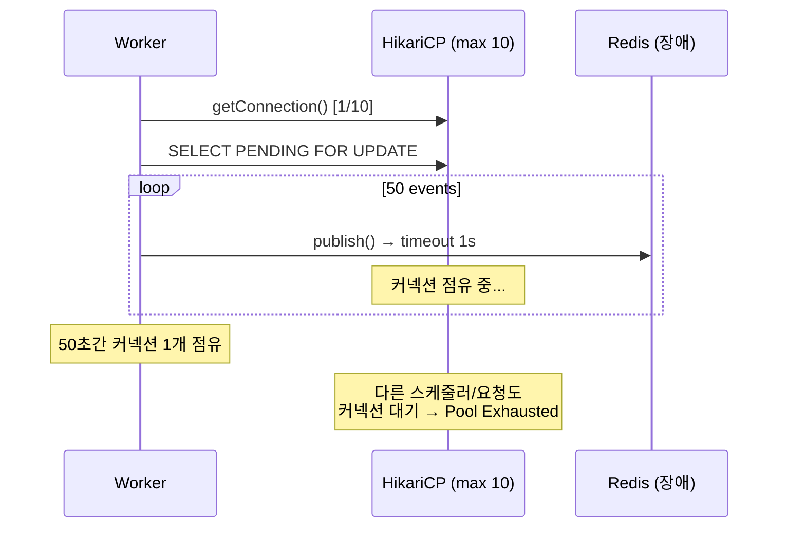
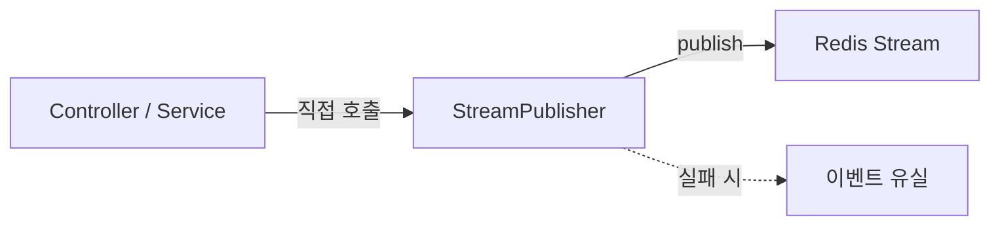
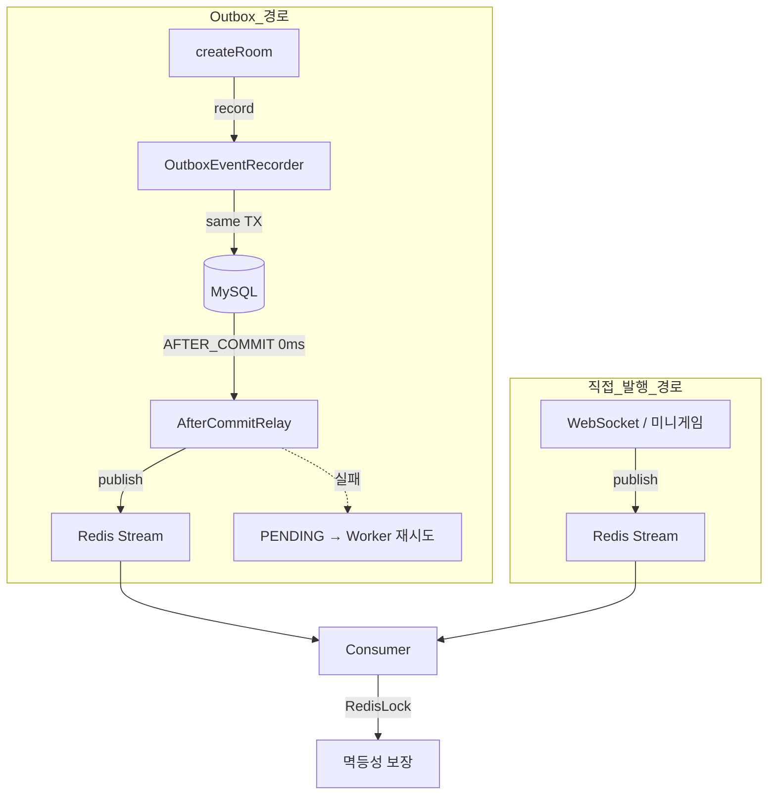

## DB 커밋은 됐는데 이벤트가 사라진다

ZZOL은 실시간 멀티플레이어 게임 서비스다. 방 생성, 룰렛 스핀, 미니게임 결과 같은 핵심 비즈니스 이벤트를 Redis Stream으로 브로드캐스트해서 WebSocket 클라이언트에게 전달하는 구조로 되어 있다.

문제는 `RoomService.createRoom()`에 있었다.

```java
@Transactional
public Room createRoom(String hostName) {
    final Room room = roomCommandService.saveIfAbsentRoom(joinCode, new PlayerName(hostName));

    streamPublisher.publish(StreamKey.ROOM_BROADCAST, event);  // Redis Stream에 직접 쏜다

    saveRoomEntity(joinCode.getValue());  // DB 저장

    return room;
}
```

이 코드의 문제는 두 가지다. 첫째, `streamPublisher.publish()`가 트랜잭션 커밋 전에 호출된다. 트랜잭션이 롤백되면 Redis에는 이벤트가 남아있고 DB에는 데이터가 없는 유령 이벤트가 발생한다. 둘째, 트랜잭션이 성공적으로 커밋되더라도 그 직후 Redis 장애나 네트워크 타임아웃이 발생하면 DB에는 데이터가 있는데 다른 서버 인스턴스는 이벤트를 못 받는 상황이 된다.

이걸 **Dual Write Problem**이라고 부른다. DB와 Redis라는 두 개의 저장소에 동시에 쓰는데, 둘 다 성공하거나 둘 다 실패하는 것을 보장할 수 없는 구조적 문제다.

## 왜 단순한 해법으로는 안 되는가

가장 먼저 떠오르는 해법부터 검토했다.

**"Redis 발행 실패하면 DB도 롤백하면 되지 않느냐?"** 일관성은 유지되지만 가용성이 망가진다. Redis가 30초만 장애가 나도 방 생성, 룰렛, 미니게임 전체가 먹통이 된다. Redis 장애가 비즈니스 로직의 가용성을 직접 갉아먹는 구조는 받아들일 수 없었다.

**"DB와 Redis를 하나의 트랜잭션으로 묶으면 되지 않느냐?"** Redis는 MySQL과 분산 트랜잭션(XA/2PC)을 지원하지 않는다. 물리적으로 불가능하다.

**"Kafka + Debezium 같은 CDC를 쓰면 되지 않느냐?"** 현재 인프라는 단일 MySQL + 단일 Redis다. Kafka 클러스터와 Debezium 커넥터를 올리는 건 운영 복잡도를 몇 배로 키운다. 오버엔지니어링이라 판단했다.

결국 **현재 스택(Spring Boot 3.x, MySQL, Redis) 안에서 해결**해야 했다. 여기서 Transactional Outbox 패턴이 등장한다.

## Transactional Outbox 패턴이란

핵심 아이디어는 단순하다. **이벤트를 외부 시스템(Redis)에 직접 쏘는 대신, DB에 먼저 저장한다.**

비즈니스 데이터를 저장하는 트랜잭션 안에서 "이런 이벤트를 발행해야 한다"는 레코드를 `outbox_event`라는 별도 테이블에 함께 INSERT한다. 같은 MySQL 트랜잭션이므로 비즈니스 데이터와 이벤트 레코드가 **반드시 함께 커밋되거나 함께 롤백**된다. 원자성이 보장되는 것이다.

그 다음, 별도의 Worker(또는 리스너)가 `outbox_event` 테이블에서 아직 발행되지 않은 레코드를 읽어서 Redis Stream에 발행한다. 발행이 성공하면 해당 레코드를 "발행 완료" 상태로 갱신한다.

```
Before (Dual Write):
  createRoom() → DB에 저장 + Redis에 발행  ← 둘 중 하나만 실패하면 불일치

After (Outbox):
  createRoom() → DB에 저장 + Outbox 테이블에 이벤트 저장 (같은 트랜잭션)
  Worker       → Outbox에서 읽어서 Redis에 발행              (별도 단계)
```

이 구조에서 Redis가 죽어도 비즈니스 로직은 정상 동작한다. 이벤트는 Outbox 테이블에 안전하게 보관되고, Redis가 복구되면 밀린 이벤트가 순서대로 발행된다.

## Outbox 엔티티 설계

Outbox 테이블에 저장할 정보를 정했다. 최소한의 정보만 남기되, 장애 복구와 모니터링에 필요한 컬럼은 포함했다.

```java
@Entity
@Table(name = "outbox_event")
public class OutboxEvent {

    @Id
    @GeneratedValue(strategy = GenerationType.IDENTITY)
    private Long id;                    // 순서 보장용 PK (AUTO_INCREMENT)

    @Column(nullable = false, length = 50)
    private String streamKey;           // 어느 Redis Stream에 발행할지

    @Column(nullable = false, columnDefinition = "TEXT")
    private String payload;             // 이벤트 본문 (JSON)

    @Enumerated(EnumType.STRING)
    @Column(nullable = false, length = 20)
    private OutboxStatus status;        // PENDING → IN_PROGRESS → PUBLISHED

    @Column(nullable = false)
    private int retryCount;             // 재시도 횟수 (10회 초과 시 DEAD_LETTER)

    @Column(nullable = false, updatable = false)
    private LocalDateTime createdAt;    // 생성 시각 (cleanup 기준)

    @Column(nullable = false)
    private LocalDateTime updatedAt;    // 마지막 상태 전이 시각 (stale 복구 기준)
}
```

`id`를 AUTO_INCREMENT로 설정한 이유가 있다. Outbox 폴링 시 `id` 기준으로 정렬하면 이벤트 발행 순서가 비즈니스 트랜잭션 커밋 순서와 일치한다.

`createdAt`과 `updatedAt`을 분리한 이유도 있다. 처음에는 `createdAt` 하나로 stale 이벤트 복구와 PUBLISHED 레코드 정리를 둘 다 처리했는데, 생성된 지 5분이 지난 이벤트가 방금 `IN_PROGRESS`로 전환되자마자 복구 대상이 되는 버그가 있었다. `updatedAt`을 도입해서 **상태 전이 시점 기준으로 stale을 판별**하고, `createdAt`은 **이벤트 수명 기준으로 cleanup에만 사용**하도록 분리했다.

## 이벤트의 상태는 어떻게 흘러가는가

Outbox 레코드는 생성부터 삭제까지 다음과 같은 상태를 거친다.

- **PENDING**: 이벤트가 생성된 직후 상태. 아직 Redis에 발행되지 않았다.
- **IN_PROGRESS**: Worker가 이 이벤트를 집어들고 Redis 발행을 시도 중인 상태.
- **PUBLISHED**: Redis 발행이 성공한 상태. 24시간 후 cleanup 스케줄러가 삭제한다.
- **DEAD_LETTER**: 10회 이상 발행에 실패한 상태. 자동 재시도를 포기하고 별도로 모니터링한다.

이 상태 전이에는 두 가지 경로가 있다. 평상시에는 `AFTER_COMMIT` 즉시 발행으로 `PENDING → PUBLISHED`가 바로 일어나고(이건 아래에서 설명한다), Redis 장애 시에만 Worker를 거쳐서 `PENDING → IN_PROGRESS → PUBLISHED`로 흐른다.

```mermaid
flowchart TD
    S(( )) -->|"record()"| P[PENDING]

    P -->|"AFTER_COMMIT<br/>즉시 발행"| PUB[PUBLISHED]
    P -->|"Worker<br/>SKIP LOCKED"| IP[IN_PROGRESS]

    IP -->|"발행 성공"| PUB
    IP -.->|"실패 or stale"| P
    IP -->|"10회 실패"| DL[DEAD_LETTER]

    PUB -->|"cleanup 24h"| E(( ))

    style S fill:#000,stroke:#000
    style E fill:#fff,stroke:#000
    style PUB fill:#d4edda,stroke:#28a745
    style DL fill:#f8d7da,stroke:#dc3545
```



## 트랜잭션 경계 설계 — 이벤트를 언제 Redis에 보낼 것인가

Outbox 테이블에 이벤트를 저장하는 것까지는 단순하다. 핵심은 **트랜잭션이 확실히 커밋된 후에** Redis Stream으로 이벤트를 릴레이하는 타이밍을 어떻게 잡느냐다.

### 1차 시도: 폴링 전용 — 전부 Outbox로 돌리자

Outbox 테이블에 이벤트를 저장한 후, 그걸 Redis로 보내는 타이밍을 잡는 방법은 크게 두 가지가 있다.

**방법 A: Polling 전용.** 별도의 Worker 스레드가 주기적으로(예: 500ms마다) Outbox 테이블을 조회해서, PENDING 상태인 레코드를 찾아 Redis에 발행하는 방식이다. 구현이 단순하고 모든 이벤트가 동일한 경로를 타기 때문에 동작을 예측하기 쉽다. 단점은 폴링 주기만큼 지연이 발생한다는 것이다. 500ms마다 폴링하면 최대 500ms의 지연이 붙는다.

**방법 B: AFTER_COMMIT + Polling 재시도.** 트랜잭션이 커밋되는 순간 Spring의 이벤트 리스너가 즉시 Redis에 발행을 시도하고, 발행이 실패한 경우에만 Worker가 재시도하는 방식이다. 평상시에는 커밋 직후 바로 발행되므로 지연이 거의 0ms다. 대신 "커밋 직후 즉시 발행" + "실패 시 폴링 재시도"라는 두 경로를 모두 관리해야 해서 구현 복잡도가 올라간다.

|방식|장점|단점|
|---|---|---|
|AFTER_COMMIT + 폴링 재시도|평시 지연 0ms. 실패 시에만 폴링|구현 복잡도 증가|
|Polling 전용|구현 단순. 일관된 경로|최대 500ms 지연 발생|

처음에는 코드베이스의 모든 `streamPublisher.publish()` 호출을 `outboxEventRecorder.record()`로 교체하고, Polling 전용 방식으로 500ms마다 Worker가 일괄 처리하는 구조를 선택했다. "모든 이벤트가 동일한 경로를 타면 동작의 예측 가능성이 올라간다." 이 논리로 폴링 전용을 선택했다. 하지만 통합 테스트를 돌려보니 문제가 터졌다.

### 현실과 충돌: 기존 테스트 7개가 전멸했다

모든 이벤트를 Outbox 폴링 경로로 바꿨더니 기존 통합 테스트가 줄줄이 깨졌다. 실패 원인을 분석하면 크게 세 가지였다.

**첫 번째: 요청-응답 패턴과의 충돌.** `enterRoomAsync()`는 이벤트를 Redis Stream에 쏘고 `CompletableFuture`로 Consumer의 처리 결과를 5초 안에 기다리는 구조다. Outbox 폴링 500ms 지연이 끼어들면서 타임아웃이 발생했다.

**두 번째: 이벤트 순서 역전.** `createRoom()`이 Outbox에 `RoomCreateEvent`를 저장하면, 500ms 후에야 Consumer에 도달한다. 그 사이에 `enterRoomAsync()`가 `RoomJoinEvent`를 직접 Redis에 쏘면, "방 참가" 이벤트가 "방 생성" 이벤트보다 먼저 처리된다.

**세 번째: 실시간 게임 입력의 체감 지연.** 미니게임 탭 이벤트, 카드 선택 같은 인게임 액션에 500ms 지연이 붙으면 게임이 안 된다.

모든 이벤트를 Outbox로 돌리는 건 문제를 해결하는 게 아니라 새로운 문제를 만드는 셈이었다.

### 2차 시도: 이벤트 발행 경로를 분류하자

코드베이스의 모든 `streamPublisher.publish()` 호출을 전수 조사해서 분류했다.

|경로|DB 변경|실시간성|Outbox 필요?|이유|
|---|---|---|---|---|
|`createRoom()`|`saveRoomEntity()`|즉시 필요|**필요**|DB 저장과 이벤트 발행의 원자성 보장|
|`enterRoomAsync()`|없음 (Consumer에서)|즉시 필요|불필요|CompletableFuture 요청-응답 패턴|
|WebSocket 컨트롤러|없음|즉시 필요|불필요|사용자 인터랙션 실시간 응답|
|미니게임/레이싱 입력|없음|즉시 필요|불필요|0.1초가 중요한 인게임 액션|
|세션 이벤트, QR코드|없음|준실시간|불필요|DB 원자성 불필요|

결론은 명확했다. **Outbox가 필요한 경로는 `createRoom()` 하나뿐이었다.** DB 상태 변경과 이벤트 발행이 같은 트랜잭션에서 원자적으로 일어나야 하는 유일한 지점이다.

하지만 여기에 500ms 폴링 지연을 넣으면 이벤트 순서 역전이 발생한다. 지연 시간 0ms를 보장하면서도 원자성을 지키는 방법이 필요했다.

## 왜 AFTER_COMMIT인가 — Spring 트랜잭션 이벤트 리스너

여기서 잠깐, Spring이 제공하는 트랜잭션 이벤트 리스너를 정리해야 한다. Spring에는 `@TransactionalEventListener`라는 어노테이션이 있다. 트랜잭션의 특정 시점에 이벤트를 수신할 수 있는데, `phase` 속성으로 타이밍을 지정한다.

|phase|실행 시점|특징|
|---|---|---|
|`BEFORE_COMMIT`|트랜잭션 커밋 직전|커밋이 아직 안 됐으므로 여기서 실패하면 전체 롤백. Outbox용으로 부적합 — DB에 데이터가 확정되기 전에 Redis에 쏘면 Dual Write 문제가 그대로다|
|`AFTER_COMMIT`|트랜잭션 커밋 직후|DB 데이터가 확정된 상태에서 실행. Redis 발행이 실패해도 DB 데이터에 영향 없음. **Outbox 즉시 발행에 적합**|
|`AFTER_ROLLBACK`|트랜잭션 롤백 후|롤백된 이벤트를 보상 처리할 때 사용. Outbox와 무관|
|`AFTER_COMPLETION`|커밋/롤백 상관없이 완료 후|성공/실패를 구분해야 해서 Outbox용으로 불필요하게 복잡|

**`AFTER_COMMIT`을 선택한 이유**: 트랜잭션이 커밋된 직후에 실행되므로 DB에 비즈니스 데이터와 Outbox 레코드가 확실히 저장된 상태에서 Redis 발행을 시도할 수 있다. 발행이 실패해도 이미 커밋된 트랜잭션에는 영향이 없고, Outbox에 PENDING 상태로 레코드가 남아있으니 Worker가 재시도한다.

## 2단 Outbox — AFTER_COMMIT 즉시 발행 + 폴링 재시도

처음에 "구현 복잡도" 때문에 버렸던 `@TransactionalEventListener(AFTER_COMMIT)` 카드를 다시 꺼냈다. 1차 시도에서 이걸 포기한 이유는 "트랜잭션이 없는 호출 경로에서 동작이 달라진다"였는데, 이제 Outbox를 적용하는 곳이 `createRoom()` 하나뿐이고 여기에는 `@Transactional`이 확실히 붙어있다. 처음에 우려했던 문제가 사라진 것이다.

동작 흐름은 이렇다.



**평상시(초록 영역):** 트랜잭션 커밋 직후 `AFTER_COMMIT` 리스너가 실행되어 Redis에 즉시 발행한다. 지연 0ms. 성공하면 Outbox 레코드를 PUBLISHED로 전환한다.

**Redis 장애 시(주황 영역):** 즉시 발행이 실패하면 예외를 삼킨다. DB에는 이미 PENDING 상태로 Outbox 레코드가 커밋되어 있다. 500ms 후 Worker가 PENDING 레코드를 주워서 재시도한다.

### OutboxEventRecorder — 저장 + Spring 이벤트 발행

```java
@Component
public class OutboxEventRecorder {

    @Transactional(propagation = Propagation.REQUIRED)
    public void record(StreamKey streamKey, BaseEvent event) {
        final String payload = objectMapper.writeValueAsString(event);
        final OutboxEvent outboxEvent = OutboxEvent.create(streamKey.getRedisKey(), payload);
        outboxEventRepository.saveAndFlush(outboxEvent);

        // Spring 내부 이벤트 → 트랜잭션 커밋 후 AfterCommitRelay가 수신
        applicationEventPublisher.publishEvent(
            new OutboxSavedEvent(outboxEvent.getId(), streamKey.getRedisKey(), payload)
        );
    }
}
```

`saveAndFlush()`를 쓰는 이유가 있다. `save()`만 하면 `GenerationType.IDENTITY`에서 ID 할당이 flush 시점까지 지연될 수 있다. `OutboxSavedEvent`에 `outboxEventId`를 담아야 하므로 즉시 flush해서 ID를 확보한다.

`Propagation.REQUIRED`로 설정한 이유도 있다. `createRoom()`에 이미 `@Transactional`이 붙어있으므로, `record()`는 그 트랜잭션에 참여한다. 비즈니스 데이터(`RoomEntity`)와 Outbox 레코드가 함께 커밋된다. 이게 Outbox 패턴의 핵심 — 단일 트랜잭션 원자성이다.

### OutboxAfterCommitRelay — 커밋 직후 즉시 발행

```java
@Component
public class OutboxAfterCommitRelay {

    @TransactionalEventListener(phase = TransactionPhase.AFTER_COMMIT)
    public void onOutboxSaved(OutboxSavedEvent savedEvent) {
        try {
            final BaseEvent baseEvent = objectMapper.readValue(
                savedEvent.payload(), BaseEvent.class);
            streamPublisher.publish(
                StreamKey.fromRedisKey(savedEvent.streamKey()), baseEvent);

            // REQUIRES_NEW로 새 트랜잭션 강제
            eventProcessor.markPublished(savedEvent.outboxEventId());
        } catch (Exception e) {
            // 실패해도 예외를 삼킨다. PENDING으로 남아있으니 Worker가 재시도
            log.warn("Outbox 즉시 발행 실패: id={}", savedEvent.outboxEventId());
        }
    }
}
```

이 메서드에서 주의해야 할 곳이 두 군데다.

첫 번째는 `try-catch`로 예외를 삼키는 부분이다. `AFTER_COMMIT`에서 예외가 터져도 이미 커밋된 트랜잭션에는 영향이 없지만, 명시적으로 삼켜서 안전하게 실패한다.

두 번째는 `markPublished()`의 트랜잭션 전파 레벨이다. `AFTER_COMMIT` 리스너는 원래 트랜잭션이 커밋된 직후에 실행되는데, Spring 내부적으로 원래 트랜잭션의 동기화 컨텍스트가 아직 활성 상태다. 여기서 `Propagation.REQUIRED`(기본값)로 새 DB 작업을 하면, Spring이 "아직 활성인" 원래 트랜잭션에 참여하려 한다. 하지만 그 트랜잭션은 이미 커밋됐기 때문에 변경 사항이 DB에 반영되지 않는다. 처음에 이걸 모르고 `REQUIRED`로 호출했다가 `PUBLISHED`로 전환이 안 되는 버그를 겪었다. `Propagation.REQUIRES_NEW`로 설정해서 강제로 새 트랜잭션을 열어야 한다.

### createRoom() — 최종 형태

```java
@Transactional
public Room createRoom(String hostName) {
    final Room room = roomCommandService.saveIfAbsentRoom(joinCode, new PlayerName(hostName));
    final BaseEvent event = new RoomCreateEvent(hostName, joinCode.getValue());

    // Outbox 경로: DB 저장과 원자적으로 묶이고, 커밋 직후 즉시 발행 (0ms)
    outboxEventRecorder.record(StreamKey.ROOM_BROADCAST, event);

    saveRoomEntity(joinCode.getValue());
    return room;
}
```

나머지 이벤트 발행 경로(`broadcastReady()`, `enterRoomAsync()`, 미니게임 입력 등)는 `streamPublisher.publish()` 직접 발행을 유지한다. DB 원자성이 필요 없고 실시간성이 핵심인 경로들이다.

## Outbox Relay Worker — 처음 구현에서 삽질한 이야기

### 폴링 간격과 배치 설정값

Worker는 `AFTER_COMMIT` 즉시 발행이 실패한 이벤트만 수거하는 Fallback 역할이다. 평상시에는 PENDING 이벤트가 없다.

폴링 간격 500ms, 배치 50건, 최대 재시도 10회. 500ms는 Redis 장애 복구 후 밀린 이벤트를 빠르게 처리하면서 DB 부하를 최소화하는 균형점이다. PENDING이 없으면 인덱스만 타고 빈 결과를 반환하므로 부하가 거의 없다. 10회(=5초) 연속 실패하면 인프라 장애로 판단해 DEAD_LETTER로 뺀다.

### 처음 구현: @Transactional로 배치 전체를 감쌌다

처음 작성한 Worker 코드는 이랬다.

```java
@Scheduled(fixedDelay = 500)
@Transactional  // 이게 시스템을 죽일 수 있다
public void relay() {
    List<OutboxEvent> pendingEvents = outboxEventRepository
        .findPendingEventsForUpdate(BATCH_SIZE);

    for (OutboxEvent event : pendingEvents) {
        streamPublisher.publish(...);  // Redis I/O
        event.markPublished();
    }
}
```

`@Transactional`이 메서드 전체를 감싸고 있으므로, 메서드가 끝날 때까지 DB 커넥션을 반환하지 않는다. Redis에 장애가 나서 `publish()`가 타임아웃(1초)까지 블로킹되면, 50개를 순회하는 동안 최대 50초 동안 DB 커넥션 하나를 물고 놓지 않는다. **Redis 장애가 DB 장애로 전파되는 Cascading Failure**가 발생한다.



### 해결: 트랜잭션과 Redis I/O를 완전히 분리했다

`relay()` 메서드에서 `@Transactional`을 제거하고, DB 조작을 별도 컴포넌트(`OutboxEventProcessor`)의 개별 트랜잭션 메서드로 분리했다.

```java
@Scheduled(fixedDelay = 500)
public void relay() {
    // 1단계: TX-1 — PENDING → IN_PROGRESS + COMMIT (DB 커넥션 즉시 반환)
    final List<OutboxEvent> events = eventProcessor.fetchAndMarkInProgress(BATCH_SIZE);
    if (events.isEmpty()) return;

    for (final OutboxEvent event : events) {
        try {
            // 2단계: No TX — Redis I/O (DB 커넥션 없이 실행)
            final BaseEvent baseEvent = objectMapper.readValue(event.getPayload(), BaseEvent.class);
            streamPublisher.publish(StreamKey.fromRedisKey(event.getStreamKey()), baseEvent);

            // 3단계: TX-2 — 단건 업데이트
            eventProcessor.markPublished(event.getId());
        } catch (Exception e) {
            eventProcessor.handleFailure(event.getId());
        }
    }
}
```

1단계에서 DB 커넥션을 잡고, PENDING 레코드를 IN_PROGRESS로 바꾸고, **즉시 커밋해서 커넥션을 반환**한다. 2단계에서 Redis I/O가 아무리 오래 걸려도 DB 커넥션에는 영향이 없다. 3단계에서 다시 짧게 DB 커넥션을 잡아서 상태를 갱신한다.

여기서 `OutboxEventProcessor`를 **같은 클래스 안에 두지 않고 별도 컴포넌트로 분리한 이유**가 있다. Spring의 `@Transactional`은 AOP 프록시 기반으로 동작한다. 같은 클래스 내에서 `this.fetchAndMarkInProgress()`로 호출하면 프록시를 거치지 않아 `@Transactional`이 동작하지 않는다. 별도 Bean으로 분리해야 프록시를 통한 트랜잭션 관리가 정상 작동한다.

### IN_PROGRESS에서 서버가 죽으면?

`IN_PROGRESS` 상태를 도입하면 새로운 엣지 케이스가 생긴다. Worker가 `IN_PROGRESS`로 바꾼 후 Redis 발행 전에 서버가 죽으면, 해당 이벤트는 영원히 `IN_PROGRESS`에 갇힌다.

별도 스케줄러로 복구한다. 1분마다 돌면서 `updatedAt` 기준 5분 이상 `IN_PROGRESS`로 남아있는 이벤트를 `PENDING`으로 되돌린다. 5분으로 잡은 이유는, Redis 타임아웃(1초) × 배치 50건 = 50초가 최악의 정상 케이스이기 때문이다. 5분이면 충분한 여유다.

이 복구 시 중복 발행이 발생할 수 있다. 하지만 기존에 구축해둔 `@RedisLock` 기반 Consumer 멱등성이 안전하게 흡수한다. Outbox는 **At-least-once**(최소 한 번 전송)를 보장하는 구조이고, 중복은 Consumer 쪽에서 걸러내는 것이 설계 원칙이다.

## 동시성 제어 — 다중 인스턴스에서 중복 발행 방어

서버가 2대 이상일 때 각 서버의 Worker가 동시에 같은 PENDING 레코드를 읽으면 Redis에 이벤트가 2번 발행된다.

처음에 Redisson 분산 락을 쓰려고 했다. 하지만 Outbox를 도입하는 이유가 "Redis 장애 대비"인데, 릴레이 동시성 제어를 Redis에 맡기면 순환 의존이다.

MySQL `SELECT ... FOR UPDATE SKIP LOCKED`를 선택했다. 이 쿼리는 다른 트랜잭션이 이미 락을 잡은 행을 건너뛰고 다음 행을 가져온다. 각 서버가 서로 다른 레코드를 처리하게 되므로 중복 발행이 원천 차단된다. 데드락도 없고, 대기도 없다.

```java
@Query(
    value = "SELECT * FROM outbox_event " +
            "WHERE status = 'PENDING' " +
            "ORDER BY id ASC " +
            "LIMIT :size " +
            "FOR UPDATE SKIP LOCKED",
    nativeQuery = true
)
List<OutboxEvent> findPendingEventsForUpdate(@Param("size") int size);
```

## 처리 완료된 레코드 정리

매일 새벽 4시에 24시간 이전의 PUBLISHED 레코드를 삭제한다. 장애 역추적을 위해 24시간 보존 기간을 둔다.

## 결과

### Before



### After



- `createRoom()`: DB 원자성 + 즉시 발행(0ms) + Redis 장애 시 자동 재시도
- 나머지: 직접 발행 유지. 실시간 게임에 영향 없음
- Worker 트랜잭션 분리로 Redis 장애 → DB 장애 전파 차단
- `SKIP LOCKED`로 다중 인스턴스 중복 발행 차단
- At-least-once + Consumer 멱등성 = 전체 정합성 보장

## 정리

이번 설계에서 핵심 판단은 다섯 가지였다.

첫째, **이벤트 발행 경로를 분류한 것**이다. 처음에는 모든 이벤트를 Outbox로 돌리려 했다가 기존 테스트가 전멸했다. 전수 조사해서 "DB 원자성이 필요한 경로"와 "실시간성이 핵심인 경로"를 분리했다. `createRoom()`만 Outbox를 적용하고 나머지는 직접 발행을 유지한 것이 이번 설계의 출발점이다.

둘째, **AFTER_COMMIT 즉시 발행 + 폴링 재시도의 2단 구조를 채택한 것**이다. 처음에는 "구현 복잡도" 때문에 폴링 전용을 선택했다가, 500ms 지연이 만드는 문제를 직접 겪었다. `createRoom()`에만 적용하면 `@Transactional` 보장이 확실하므로 처음에 우려했던 문제가 없다. 적용 범위를 좁힌 덕분에 처음에 포기했던 카드를 다시 꺼낼 수 있었다.

셋째, **Relay Worker의 트랜잭션과 Redis I/O를 분리한 것**이다. `@Transactional`로 배치 전체를 감싸는 실수를 했고, Cascading Failure 위험을 발견했다. `IN_PROGRESS` 상태를 도입해서 DB 커넥션 점유를 최소화했다.

넷째, 동시성 제어에 Redis 락이 아닌 MySQL `SKIP LOCKED`를 선택한 것이다. Outbox의 존재 이유가 Redis 장애 대비인데, 릴레이 동시성 제어를 Redis에 맡기면 순환 의존이 된다.

다섯째, **Outbox의 At-least-once 특성을 Consumer의 멱등성으로 보완한 것**이다. 기존에 구축해둔 `@RedisLock` 기반 멱등성 방어 로직이 중복 발행을 안전하게 흡수한다. 새로운 패턴과 기존 인프라가 맞물려서 전체 시스템의 정합성이 완성되는 구조다.
