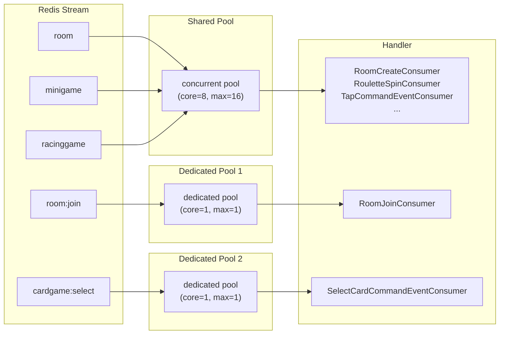

ZZOL의 모든 실시간 이벤트는 Redis Stream을 통해 흐른다. 방 생성, 입장, 카드 선택, 미니게임, 레이싱 탭 — 5개 스트림이 각각의 리스너로 메시지를 소비한다. 처음에는 하나의 스레드풀로 전부 처리했다. 그러다 특정 이벤트의 특성 때문에 스레드풀을 분리해야 하는 상황이 생겼고, "어떤 스트림에 어떤 풀을 배정하는가"를 설계한 과정을 기록한다.

## 5개 스트림과 각각의 역할

ZZOL에서 사용하는 Redis Stream은 5개다.

```java
public enum StreamKey {
    ROOM_BROADCAST("room"),
    ROOM_JOIN("room:join"),
    CARD_GAME_SELECT_BROADCAST("cardgame:select"),
    MINIGAME_EVENTS("minigame"),
    RACING_GAME_EVENTS("racinggame");
}
```

각 스트림에 흐르는 이벤트의 특성이 다르다.

`room` 스트림에는 방 생성, 룰렛 표시, 룰렛 결과, 플레이어 목록 갱신, 준비 상태 변경, 강퇴, QR코드 상태 같은 이벤트가 흐른다. 이벤트 간 순서가 크게 중요하지 않다. 방 생성과 QR코드 상태는 독립적이고, 룰렛 결과가 플레이어 목록 갱신보다 먼저 처리되든 나중에 처리되든 최종 결과는 같다.

`room:join`에는 입장 이벤트만 흐른다. 이건 좀 다르다. 같은 방에 플레이어 A, B, C가 동시에 입장하면 `RoomJoinEvent`가 세 건 발행된다. 이 세 건이 **순서대로 처리되어야** 한다. 왜냐하면 `RoomService.joinRoom()` 내부에서 현재 방의 플레이어 수를 확인하고, 정원 초과 여부를 판단하기 때문이다. 두 이벤트가 동시에 처리되면 둘 다 "아직 자리 있음"으로 판단해서 정원을 초과할 수 있다.

`cardgame:select`에는 카드 선택 이벤트가 흐른다. 같은 방의 플레이어가 동시에 카드를 선택하면 여러 건이 발행되는데, 각 플레이어의 선택은 독립적이다. A가 1번 카드를 고르고 B가 3번 카드를 고르는 건 서로 간섭하지 않는다. 하지만 같은 플레이어가 빠르게 두 번 선택하면 순서가 보장되어야 한다.

`minigame`에는 미니게임 시작/종료 이벤트가 흐른다. 방마다 독립적으로 진행되므로 다른 방의 이벤트와는 순서가 상관없다.

`racinggame`에는 레이싱 게임의 탭 이벤트가 흐른다. 플레이어가 화면을 탭할 때마다 발행되므로 **빈도가 가장 높다**. 초당 수십 건이 발생할 수 있다. 각 탭은 독립적이라 순서 보장이 필수는 아니지만, 처리 속도가 빨라야 한다.

## 처음에는 전부 하나의 풀로 처리했다

처음 설계에서는 모든 스트림이 하나의 `ThreadPoolTaskExecutor`를 공유했다.

```yaml
redis:
  stream:
    thread-pools:
      shared:
        core-size: 8
        max-size: 16
        queue-capacity: 1024
```

5개 스트림의 리스너가 전부 이 풀에서 스레드를 꺼내 이벤트를 처리했다. 처음에는 문제가 없었다. 동시 접속자가 적고, 이벤트 빈도가 낮을 때는 8개 스레드면 충분했다.

문제는 레이싱 게임을 추가하면서 시작됐다. 레이싱 게임에서 플레이어 4명이 동시에 탭을 하면 초당 수십 건의 `TapCommandEvent`가 쏟아진다. shared 풀의 스레드 8개 중 상당수가 탭 이벤트 처리에 점유되면서, 같은 풀을 쓰는 `room` 스트림의 다른 이벤트 처리가 밀렸다. 한 방에서 레이싱이 진행되는 동안 다른 방에서 룰렛을 돌리거나 방을 생성하면, 해당 이벤트가 큐에서 대기하는 시간이 눈에 띄게 늘었다.

이때 스레드풀 분리를 결정했다. 어떤 기준으로 분리할지가 문제였다.

## 스트림별 스레드풀 전략

### 분리 기준: 두 가지 질문

처음에는 단순히 "빈도가 높은 스트림에 스레드를 더 주자"고 생각했다. 하지만 레이싱 탭 이벤트에 스레드를 더 배정해봐야, `room:join`이 여전히 같은 풀을 쓰면 starvation 문제는 해결되지 않는다. 문제의 본질은 스레드 수가 아니라 **풀의 격리**였다.

어떤 스트림에 어떤 풀을 배정할지 결정할 때 두 가지를 기준으로 삼았다.

첫째, **순서 보장이 필요한가?** 같은 스트림의 이벤트가 반드시 순서대로 처리되어야 하면 단일 스레드여야 한다. 스레드가 2개 이상이면 이벤트 A가 먼저 도착했어도 스레드 스케줄링에 따라 이벤트 B가 먼저 처리될 수 있다.

둘째, **이벤트 빈도가 높아서 다른 스트림의 처리를 밀어낼 수 있는가?** 빈도가 높은 스트림이 빈도가 낮은 스트림과 풀을 공유하면, 낮은 쪽이 starvation을 겪는다. 이런 스트림은 격리하거나 별도 풀을 줘야 한다.

이 두 기준으로 분류하면 이렇다.

||Ordering Required|Ordering Not Required|
|---|---|---|
|**High Frequency**|`room:join`, `cardgame:select`|`racinggame`|
|**Low Frequency**|—|`room`, `minigame`|

왼쪽(순서 필요)은 단일 스레드 전용 풀, 오른쪽(순서 불필요)은 공유 풀이 기본 방향이다. 하지만 이 매트릭스만으로는 부족했다. 세 번째 변수가 있었다.

### 세 번째 기준: 핸들러 실행 시간

단일 스레드 풀을 배정하면 순서는 보장되지만, **처리 지연이 곧바로 사용자 응답 지연으로 이어진다**는 제약이 생긴다. 스레드가 1개이므로 큐에 쌓인 이벤트는 앞의 이벤트가 끝나야 처리된다.

만약 `room:join` 핸들러가 DB 지연 등으로 500ms 걸린다면? 큐에 10건이 쌓여있으면 10번째 유저는 입장에만 5초를 기다려야 한다. 단일 스레드로 순서를 보장하려면, **핸들러의 실행 시간을 극도로 짧게 유지해야 한다**는 전제가 따른다.

`room:join`의 `joinRoom()`은 `ConcurrentHashMap` 기반 인메모리 저장소에서 방 상태를 읽고 플레이어를 추가하는 로직이다. 네트워크 I/O가 없다. 실측 실행 시간이 수 ms 수준이라 단일 스레드에서도 10건 처리에 충분하다. 만약 이 핸들러가 외부 API 호출이나 무거운 DB 쿼리를 포함하고 있었다면, 단일 스레드 전략은 선택할 수 없었을 것이다. 그때는 분산 락이나 Lua script로 원자성을 확보하면서 멀티 스레드로 처리하는 방향을 고려했을 것이다.

`cardgame:select`도 마찬가지다. `cardGameCommandService.selectCard()`는 같은 인메모리 저장소에서 Room을 꺼내고 CardGame 객체의 카드를 갱신하는 연산이라 수 ms 수준이다.

정리하면 단일 스레드 전략을 선택하기 위한 조건은 두 가지다. "순서 보장이 필요한가"와 "핸들러 실행 시간이 충분히 짧은가". 둘 다 만족해야 단일 스레드가 성립한다.

### 라우팅 구조

각 스트림이 어떤 풀로 라우팅되는지 정리하면 이렇다.



공유 풀을 쓰는 3개 스트림은 8~16개 스레드가 이벤트를 병렬로 처리한다. 전용 풀을 쓰는 2개 스트림은 각각 스레드 1개가 순서대로 처리한다. 풀이 물리적으로 분리되어 있으므로, `racinggame`의 탭 이벤트가 아무리 많이 들어와도 `room:join`의 처리에 영향을 주지 않는다.

### 최종 설정

```yaml
redis:
  stream:
    common-settings:
      max-length: 100
      batch-size: 10
      poll-timeout: 2s
    # 공유 스레드풀
    thread-pools:
      concurrent:
        core-size: 8
        max-size: 16
        queue-capacity: 1024
    # 스트림별 설정
    keys:
      "[room]":
        thread-pool-name: concurrent        # 공유 풀 사용
      "[room:join]":
        thread-pool:                         # 전용 풀 (단일 스레드)
          core-size: 1
          max-size: 1
          queue-capacity: 1024
      "[cardgame:select]":
        thread-pool:                         # 전용 풀 (단일 스레드)
          core-size: 1
          max-size: 1
          queue-capacity: 1024
      "[minigame]":
        thread-pool-name: concurrent        # 공유 풀 사용
      "[racinggame]":
        thread-pool-name: concurrent        # 공유 풀 사용
```

세 가지 전략으로 나뉜다.

**전용 단일 스레드: `room:join`, `cardgame:select`**

이 두 스트림은 `core-size: 1, max-size: 1`로 단일 스레드를 배정했다. 이벤트가 도착한 순서대로 하나씩 처리된다.

`room:join`을 단일 스레드로 해야 하는 이유는 앞서 설명한 것처럼 정원 초과 방지다. `joinRoom()` 안에서 "현재 몇 명인지 확인 → 입장 허용 → 플레이어 추가"가 원자적으로 이루어져야 한다. 스레드가 2개면 두 요청이 동시에 "4명 중 3명"을 읽고 둘 다 입장시켜서 5명이 될 수 있다.

`cardgame:select`도 비슷하다. 같은 플레이어가 카드를 빠르게 두 번 선택하면 "1번 선택 → 3번으로 변경"이 순서대로 처리되어야 최종 선택이 3번이 된다. 멀티 스레드에서는 3번이 먼저 처리되고 1번이 뒤에 처리되어 최종 선택이 1번이 될 수 있다.

**공유 풀: `room`, `minigame`, `racinggame`**

이 세 스트림은 `concurrent` 풀(core=8, max=16)을 공유한다.

`room` 스트림의 이벤트(방 생성, 룰렛, QR 상태 등)는 빈도가 낮고 서로 독립적이다. 순서 보장이 필요 없고, 다른 이벤트를 밀어낼 만큼 빈도가 높지 않다.

`minigame` 스트림도 마찬가지다. 미니게임 시작/종료는 방마다 독립적이고 빈도가 낮다.

`racinggame`은 빈도가 높지만 공유 풀에 남겨뒀다. 처음에는 전용 풀을 주려고 했으나, 실제로 측정해보니 탭 이벤트의 처리 시간이 매우 짧았다(1~3ms). 인메모리 저장소에서 Room을 꺼내고 RacingGame 객체의 탭 횟수를 갱신하는 게 전부라 네트워크 I/O가 없다. 처리 시간이 짧으면 스레드를 금방 반환하기 때문에, 공유 풀의 다른 스트림을 밀어내는 현상이 줄어든다. 격리의 실익이 크지 않아서 공유 풀에 유지하기로 했다.

### 왜 racinggame은 단일 스레드가 아닌가?

`racinggame`도 순서 보장이 필요하지 않냐는 의문이 생길 수 있다. 플레이어 A가 탭을 10번 했으면 10번이 순서대로 처리되어야 하지 않나?

탭 이벤트의 핵심 로직은 `racingGameService.tap(joinCode, playerName, tapCount)`다. 이벤트에 **누적 탭 횟수**가 담겨있고, 서버에서는 "이 플레이어의 현재 탭 수와 이벤트의 탭 수 중 큰 값을 취한다"는 단순한 비교다. 순서가 바뀌어도 최종 결과가 같다. 10번째 탭 이벤트가 9번째보다 먼저 도착해도, 결국 10이 반영된다. 이런 구조를 Last-Writer-Wins라고 부르는데, 순서 보장 없이도 정합성이 유지된다.

## 동적 풀 등록: yml에서 코드 변경 없이 풀을 만든다

스레드풀 설정을 yml에 선언하면, 코드 변경 없이 풀을 추가하거나 설정을 바꿀 수 있어야 한다. `RedisStreamThreadPoolConfig`에서 이를 처리한다.

```java
@PostConstruct
public void registerThreadPools() {
    // 1. 공유 풀 등록 (thread-pools 하위)
    properties.threadPools().forEach((poolName, poolConfig) ->
        applicationContext.registerBean(
            String.format(BEAN_NAME, poolName),
            ThreadPoolTaskExecutor.class,
            () -> createThreadPoolExecutor(poolConfig, String.format(BEAN_NAME, poolName))
        )
    );
    // 2. 전용 풀 등록 (keys 하위에 thread-pool 직접 선언한 경우)
    properties.keys().entrySet().stream()
        .filter(entry -> !entry.getValue().isUseSharedThreadPool())
        .forEach(entry -> {
            applicationContext.registerBean(
                String.format(BEAN_NAME, entry.getKey()),
                ThreadPoolTaskExecutor.class,
                () -> createThreadPoolExecutor(
                    entry.getValue().threadPool(),
                    String.format(BEAN_NAME, entry.getKey())
                )
            );
        });
}
```

`GenericApplicationContext.registerBean()`으로 런타임에 빈을 등록한다. yml에 `thread-pool-name: concurrent`로 선언하면 공유 풀을 참조하고, `thread-pool:`로 직접 설정을 선언하면 전용 풀이 생성된다. 스트림이 새로 추가되면 yml에 키를 추가하고 풀 전략을 선언하면 된다. Java 코드를 건드릴 필요가 없다.

처음에는 `@Bean`으로 각 풀을 하나씩 등록하려고 했다. 그런데 스트림이 5개이고, 각각 공유/전용을 선택할 수 있으니 조합이 많아졌다. 스트림이 추가될 때마다 `@Bean` 메서드를 추가하는 건 설정의 의미가 없다. yml에 선언적으로 쓰고, 코드가 그걸 읽어서 동적으로 등록하는 구조가 맞다고 판단했다.

### 초기화 순서 보장: @DependsOn

동적 빈 등록에서 한 가지 주의할 점이 있다. `@PostConstruct`에서 `registerBean()`을 호출하므로, 이 빈들을 사용하는 쪽(`RedisStreamListenerStarter`)이 스레드풀 빈이 등록된 **이후에** 초기화되어야 한다. 순서가 바뀌면 `NoSuchBeanDefinitionException`이 터진다.

```java
@Component
@DependsOn("redisStreamThreadPoolConfig")  // 스레드풀이 먼저 등록되어야 함
public class RedisStreamListenerStarter {
    // ...
}
```

처음에는 `@DependsOn` 없이 해봤다. Spring이 알아서 의존 관계를 추론해줄 거라 생각했는데, `@PostConstruct`에서 `registerBean()`으로 등록한 빈은 Spring의 의존성 그래프에 들어가지 않는다. `GenericApplicationContext`에 직접 등록한 빈이라 Spring이 "이 빈이 필요하다"는 걸 모른다. 명시적으로 `@DependsOn`을 걸어서 초기화 순서를 강제했다.

`BeanFactoryPostProcessor` 단계에서 등록하는 것도 고려했다. 이 단계에서 등록하면 Spring이 일반 빈과 동일하게 의존성을 추론한다. 하지만 `BeanFactoryPostProcessor`는 `@ConfigurationProperties` 바인딩보다 먼저 실행되기 때문에 yml에서 읽은 설정값을 사용할 수 없다. `@PostConstruct` + `@DependsOn` 조합이 가장 단순하고 의도가 명확했다.

참고로, `BeanDefinitionRegistryPostProcessor` 단계에서 Spring Boot의 `Binder` API로 `Environment` 객체에서 직접 yml 값을 읽어오면 `@ConfigurationProperties` 없이도 동적 빈 등록이 가능하다. 이 방식이 더 "스프링 네이티브"하지만, 현재 스트림 5개에 풀 3개인 규모에서는 `@DependsOn` 한 줄이면 충분하다. 설정이 더 복잡해지거나 여러 모듈에서 동적 풀을 공유해야 하는 상황이 오면 그때 전환을 고려할 것이다.

### StreamConfig의 검증

공유 풀과 전용 풀을 동시에 선언하면 안 된다. 어느 쪽을 쓸지 모호해지기 때문이다.

```java
public record StreamConfig(
        String threadPoolName,
        ThreadPoolConfig threadPool,
        // ...
) {
    public StreamConfig {
        if (threadPoolName == null && threadPool == null) {
            throw new IllegalArgumentException(
                "threadPoolName 또는 threadPool 중 하나는 반드시 지정해야 합니다."
            );
        }
        if (threadPoolName != null && threadPool != null) {
            throw new IllegalArgumentException(
                "threadPoolName과 threadPool을 동시에 지정할 수 없습니다."
            );
        }
    }
}
```

record의 compact constructor에서 검증한다. 앱 시작 시점에 잘못된 설정이 바로 터지므로, 런타임에 "어떤 풀을 쓰는 거지?"라는 혼란이 없다.

## queue-capacity: 1024를 어떻게 잡았는가

`ThreadPoolTaskExecutor`의 `queueCapacity`는 스레드가 전부 바쁠 때 이벤트가 대기하는 큐의 크기다.

### 큐 사이즈 산정

단일 스레드 풀(`room:join`, `cardgame:select`)에서 queue-capacity가 왜 중요한가. 스레드가 1개이므로 한 번에 하나의 이벤트만 처리한다. 나머지는 전부 큐에서 대기한다. 큐가 가득 차면 이벤트가 버려진다.

1024로 잡은 근거는 이렇다. ZZOL의 피크 시간에 동시에 3~4개 방이 진행된다. 방 하나에 최대 8명이 참가할 수 있다. `room:join`의 경우, 최악의 시나리오는 4개 방 × 8명 = 32건의 입장 이벤트가 순간적으로 몰리는 것이다. 하지만 현실적으로 32명이 정확히 같은 밀리초에 입장 버튼을 누르지는 않는다. 실제로는 수 초에 걸쳐 분산된다.

1024면 현재 규모에서 큐가 가득 찰 가능성이 사실상 없다. 너무 크게 잡으면 메모리 낭비이고, 너무 작게 잡으면 버스트 트래픽에 이벤트가 유실된다. 1024는 현재 규모 대비 충분한 마진이면서, `LinkedBlockingQueue`의 엔트리 하나가 수십 바이트 수준이라 메모리 부담도 없다.

공유 풀(`concurrent`)도 같은 1024를 쓴다. core=8, max=16이라 동시에 16개 이벤트를 처리할 수 있고, 나머지가 큐에 쌓인다. 레이싱 탭 이벤트가 초당 수십 건 들어와도 처리 시간이 1~3ms라서 큐에 쌓이기 전에 소화된다.

### 큐가 가득 차면 어떻게 되는가: 거절 정책

`ThreadPoolTaskExecutor`의 기본 거절 정책은 `AbortPolicy`다. 큐가 가득 차면 `RejectedExecutionException`을 던지면서 이벤트가 버려진다.

이 기본 정책을 그대로 유지하기로 했다. 이유는 두 가지다.

첫째, ZZOL의 이벤트는 게임 진행 중의 사용자 액션이다. 결제나 정산 같은 데이터가 아니라, 입장/카드 선택/탭 같은 실시간 인터랙션이다. 큐가 1024까지 차서 이벤트가 거절되는 시점이면 이미 사용자 경험이 심각하게 나빠진 상태이고, 이때 이벤트를 더 받아서 처리하는 것보다 빠르게 실패시키고 클라이언트에서 재시도하는 게 낫다.

둘째, `CallerRunsPolicy`도 고려했지만 부작용이 있다. `CallerRunsPolicy`는 큐가 가득 차면 이벤트를 제출한 스레드(caller)가 직접 실행한다. `StreamMessageListenerContainer`의 polling 스레드가 caller인데, 이 스레드가 이벤트 처리에 묶이면 다른 스트림의 메시지 polling 자체가 멈춘다. 한 스트림의 과부하가 다른 스트림의 메시지 수신까지 막는 연쇄 효과가 생긴다.

다만 거절된 이벤트가 아예 유실되는 건 아니다. Redis Stream 자체에 메시지가 남아있고, MAXLEN 100건 내에서 Container가 재시작되면 다시 읽힌다. 멱등성 처리가 되어 있으므로 재처리해도 안전하다. 즉 거절 정책은 "버려도 되니까 AbortPolicy"가 아니라, "Redis Stream이 메시지를 보존하고 있으므로 앱 레벨에서 DLQ를 별도로 구현할 필요가 없다"는 판단이다.

## 정리

Redis Stream 리스너의 스레드풀은 이벤트 특성에 따라 분리했다.

첫째, 순서 보장이 필요한 스트림(`room:join`, `cardgame:select`)은 단일 스레드 전용 풀을 배정한다. 멀티 스레드에서는 이벤트 도착 순서와 처리 순서가 보장되지 않기 때문이다. 다만 단일 스레드는 처리 지연이 곧 사용자 응답 지연으로 이어지므로, 핸들러 실행 시간이 충분히 짧아야 한다는 전제가 따른다.

둘째, 순서 보장이 불필요하고 독립적인 스트림(`room`, `minigame`, `racinggame`)은 공유 풀을 쓴다. 처리 시간이 짧고 빈도가 과도하지 않은 스트림은 격리할 실익이 없다.

셋째, 스레드풀 설정은 yml에 선언하고 코드가 동적으로 등록한다. 스트림이 추가되거나 풀 전략이 바뀌어도 Java 코드를 수정하지 않는다. 동적 등록 시 초기화 순서는 `@DependsOn`으로 보장한다.

넷째, 큐 거절 정책은 기본 `AbortPolicy`를 유지한다. Redis Stream이 메시지를 보존하고 멱등성 처리가 되어 있으므로, 앱 레벨에서 별도 DLQ가 필요하지 않다.