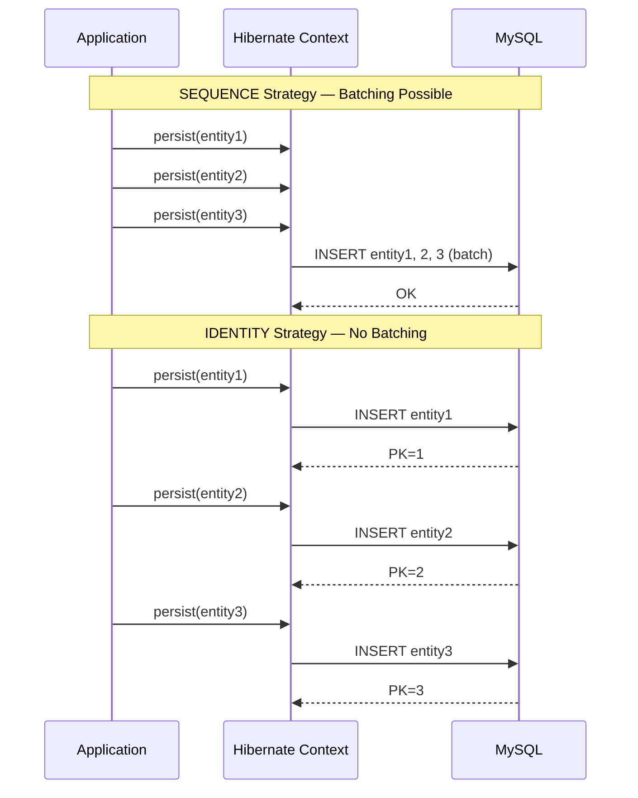

ZZOL은 미니게임이 끝나면 플레이어 9명의 결과를 DB에 저장한다. 이 저장 로직에서 트랜잭션 하나당 18번의 쿼리가 발생하고 있었고, 피크 타임에 커넥션 풀 고갈로 이어질 수 있는 구조였다. 18번을 2번으로 줄인 과정을 기록한다.

## for문 안에 숨어있던 18번의 쿼리

`MiniGameFinishedEvent`가 발행되면 `MiniGameResultSaveEventListener`가 결과를 저장한다. 기존 코드의 핵심 구조는 이랬다.

```java
for (Player player : room.getPlayers()) {
    PlayerEntity playerEntity = playerJpaRepository
            .findByRoomSessionAndPlayerName(roomEntity, player.getName().value());

    MiniGameResultEntity resultEntity = new MiniGameResultEntity(
            miniGameEntity, playerEntity, rank, score
    );

    miniGameResultJpaRepository.save(resultEntity);
}
```

방에 9명이 있으면 이 for문은 9번 돈다. 매 반복마다 SELECT 1회 + INSERT 1회. 트랜잭션 하나에 **총 18번의 쿼리**가 실행된다.

이 18번에는 두 가지 별개의 문제가 섞여 있었다. SELECT는 같은 방의 플레이어를 한 명씩 조회하는 전형적인 N+1이고, INSERT는 JPA의 IDENTITY 전략 때문에 배치가 불가능한 구조였다. 원인이 다르니 해결책도 따로 가져가야 했다.

## 이게 왜 위험한가 — 커넥션 풀 고갈 시나리오

이 서비스의 트래픽은 점심시간 20분(12:50~13:10)에 집중된다. 여러 부서에서 동시에 게임을 돌리면 방 10개가 비슷한 시간대에 끝나고, 그 순간 10개의 트랜잭션이 동시에 시작된다.

```
Peak Time Scenario (12:50 ~ 13:10)
==================================

  10 rooms finish simultaneously
    --> 10 transactions start

  Each transaction:
    9x SELECT (PlayerEntity lookup, one by one)
    + 9x INSERT (MiniGameResult save, one by one)
    = 18 queries per transaction

  Total: 10 x 18 = 180 queries

  HikariCP pool size: 10 (default)
    --> All 10 connections occupied for extended time
    --> Other requests starved
    --> connectionTimeout (30s) exceeded
    --> Cascading Failure
```

HikariCP 커넥션 풀 사이즈는 Spring Boot 기본값(maximum-pool-size=10)을 쓰고 있었다. 10개의 트랜잭션이 커넥션 10개를 전부 물고 18번씩 쿼리를 실행하는 동안, 나머지 모든 요청은 커넥션을 얻지 못한다. 기본 connectionTimeout 30초가 지나면 예외가 터지고, Tomcat 스레드(max=200)가 블로킹되면서 연쇄적으로 서비스 전체가 응답 불가에 빠진다.

핵심은 **트랜잭션 하나가 커넥션을 물고 있는 시간**이다. 쿼리 수를 줄이면 점유 시간이 줄고, 점유 시간이 줄면 풀 고갈 위험이 낮아진다. SELECT든 INSERT든, 네트워크 라운드트립 횟수를 줄이는 것이 본질이다.

## SELECT 9번을 1번으로 — IN 절 다건 조회

for문 안의 `findByRoomSessionAndPlayerName()`은 매 반복마다 이 쿼리를 실행한다.

```sql
SELECT * FROM player WHERE room_session_id = ? AND player_name = ?
```

9명이면 9번. 하지만 이 9명은 전부 같은 방에 속한 플레이어다. 한 번에 조회할 수 있는 데이터를 9번 왕복하며 가져올 이유가 없다.

`WHERE IN` 절로 다건 조회하면 1번의 쿼리로 끝난다. Spring Data JPA에서는 메서드 네이밍 규칙만으로 이 쿼리를 만들 수 있다.

```java
List<PlayerEntity> findByRoomSessionAndPlayerNameIn(
        RoomEntity roomSession, List<String> playerNames
);
```

조회 결과를 `Map<String, PlayerEntity>`로 변환해두면, for문 안에서는 DB를 치지 않고 메모리에서 O(1)으로 매핑할 수 있다.

```java
Map<String, PlayerEntity> playerEntityMap = playerJpaRepository
        .findByRoomSessionAndPlayerNameIn(roomEntity, playerNames)
        .stream()
        .collect(Collectors.toMap(PlayerEntity::getPlayerName, Function.identity()));
```

이것만으로 SELECT가 9번에서 1번으로 줄어든다.

## INSERT 9번을 1번으로 — saveAll()이 안 되는 이유

SELECT를 잡았으니 INSERT 차례다. 처음에는 단순하게 생각했다. for문 안의 `save()`를 List에 모아서 `saveAll()`로 한 방에 넣으면 되겠지. 코드를 바꾸고 Hibernate SQL 로그를 켰다.

```
Hibernate: insert into mini_game_result (...) values (?, ?, ?, ?, ?, ?)
Hibernate: insert into mini_game_result (...) values (?, ?, ?, ?, ?, ?)
Hibernate: insert into mini_game_result (...) values (?, ?, ?, ?, ?, ?)
...
```

9번의 개별 INSERT가 그대로 찍혔다. `saveAll()`이 "한 번에 저장한다"는 건 **호출이 한 번**이라는 의미지, **쿼리가 한 번**이라는 의미가 아니었다.

원인은 `MiniGameResultEntity`의 PK 전략이다.

```java
@Id
@GeneratedValue(strategy = GenerationType.IDENTITY)
private Long id;
```

`GenerationType.IDENTITY`는 MySQL의 `AUTO_INCREMENT`에 PK 생성을 위임한다. 이 전략에서 Hibernate는 `persist()` 호출 시 **즉시 INSERT를 실행**한다. 영속성 컨텍스트에 엔티티를 등록하려면 PK가 필요한데, IDENTITY 전략에서는 실제로 DB에 INSERT를 해봐야 PK를 알 수 있기 때문이다. 쓰기 지연(write-behind)이 구조적으로 불가능하다.



`saveAll()`의 내부 구현은 결국 루프를 돌면서 `persist()`를 호출하는 것이다. IDENTITY 전략에서는 각 `persist()` 마다 개별 INSERT가 즉시 나가므로, `saveAll()`을 쓰든 for문에서 `save()`를 쓰든 결과는 동일하다.

### SEQUENCE 전략 전환은 왜 안 했는가

IDENTITY 전략이 배치를 막는 거라면, SEQUENCE 전략으로 바꾸면 되지 않나? 근본적인 해결책이지만 변경 범위가 너무 넓다. MySQL은 네이티브 시퀀스를 지원하지 않기 때문에 Hibernate가 별도의 시퀀스 테이블을 생성한다. 기존 운영 데이터의 PK와 충돌하지 않도록 마이그레이션도 필요하고, 동일한 IDENTITY 전략을 쓰는 다른 엔티티들과의 일관성 문제도 생긴다. 이 엔티티 하나의 INSERT 최적화를 위해 감수할 비용이 아니었다.

||JPA saveAll()|SEQUENCE 전략 전환|JdbcTemplate batchUpdate()|
|---|---|---|---|
|배치 INSERT 가능 여부|불가 (IDENTITY 전략)|가능|가능|
|기존 코드 변경 범위|최소|Entity PK 전략 + DDL + 마이그레이션|Repository 계층 확장|
|JPA 영속성 컨텍스트|유지|유지|우회|
|Multi-row INSERT|불가|Hibernate 설정 필요|`rewriteBatchedStatements=true`로 자동|

`JdbcTemplate.batchUpdate()`를 선택했다. JPA 영속성 컨텍스트를 우회하고 JDBC 레벨에서 직접 배치 처리하는 방식이다. 포기하는 것은 1차 캐시, Dirty Checking, `@CreatedDate` 같은 JPA Auditing 기능이다. 하지만 `mini_game_result`는 게임 종료 시 한 번 쓰고 이후 수정이 발생하지 않는 append-only 데이터다. 변경 감지가 필요 없고, Auditing도 생성 시각 하나면 충분하다. 생성 시각은 엔티티 생성자에서 `LocalDateTime.now()`로 직접 세팅했다. 이 데이터 특성 때문에 JPA 기능을 포기하는 비용이 극히 낮았다.

## batchUpdate()만으로는 부족하다 — rewriteBatchedStatements

`JdbcTemplate.batchUpdate()`로 전환하고 MySQL의 General Query Log를 켜서 확인했다. 여전히 개별 INSERT가 하나씩 찍혀 있었다.

`batchUpdate()`는 JDBC 레벨에서 PreparedStatement를 배치로 모아두는 것일 뿐이다. MySQL Connector/J의 기본 동작은 이 배치를 **하나씩 서버에 전송**한다. 네트워크 라운드트립이 여전히 N번이다.

`rewriteBatchedStatements=true`를 켜야 Connector/J가 전송 직전에 여러 INSERT를 하나의 Multi-row INSERT 문으로 합친다.

```
Without rewriteBatchedStatements:
  INSERT INTO ... VALUES (1, ...);
  INSERT INTO ... VALUES (2, ...);
  INSERT INTO ... VALUES (3, ...);
  --> 3 round trips

With rewriteBatchedStatements=true:
  INSERT INTO ... VALUES (1, ...), (2, ...), (3, ...);
  --> 1 round trip
```

이 설정은 JDBC URL 파라미터로 넣을 수도 있지만, 환경별로 URL을 관리하는 구조에서는 번거롭다. HikariCP의 `data-source-properties`를 통해 공통 `application.yml`에 선언하면 local/dev/prod 어떤 프로파일이든 일괄 적용된다. **`batchUpdate()`와 `rewriteBatchedStatements`는 반드시 세트다.** 하나만 있으면 의미가 없다.

```yaml
spring:
  datasource:
    hikari:
      data-source-properties:
        rewriteBatchedStatements: true
```

이 글에서 다룬 SELECT IN 절 전환, Bulk INSERT 도입, rewriteBatchedStatements 설정을 포함한 전체 변경 내역은 [PR #1096](https://github.com/woowacourse-teams/2025-zzol/pull/1096)에서 확인할 수 있다.

## 결과

방 1개, 플레이어 9명 기준 쿼리 수 변화다.

||Before|SELECT 최적화 후|SELECT + INSERT 최적화 후|
|---|---|---|---|
|SELECT (PlayerEntity 조회)|9회|1회 (IN 절)|1회 (IN 절)|
|INSERT (MiniGameResult 저장)|9회|9회|1회 (Bulk INSERT)|
|총 쿼리 수|18회|10회|**2회**|

방 10개 동시 종료 시: **180회 → 20회.** 약 89% 감소.

```
After optimization:

  10 rooms finish simultaneously
    --> 10 transactions start

  Each transaction:
    1x SELECT IN (all players at once)
    + 1x Bulk INSERT (all results at once)
    = 2 queries per transaction

  Total: 10 x 2 = 20 queries (was 180)

  HikariCP pool size: 10 (default)
    --> Each connection held for ~2 queries
    --> Released quickly
    --> Other requests served without starvation
```

트랜잭션 하나가 18번의 순차 쿼리를 실행하던 게, 2번의 쿼리만 실행하고 커넥션을 반환하는 구조가 됐다.

## 정리

IDENTITY 전략에서는 `saveAll()`을 써도 배치 INSERT가 동작하지 않는다. Hibernate가 PK 확보를 위해 `persist()` 시점에 즉시 INSERT를 실행하기 때문이다. `JdbcTemplate.batchUpdate()`로 우회하되, MySQL Connector/J의 `rewriteBatchedStatements=true`가 반드시 함께 있어야 Multi-row INSERT가 된다.

DB 부하를 줄일 때는 INSERT만 볼 게 아니라 SELECT도 같이 봐야 한다. INSERT를 9번에서 1번으로 줄여놓고 SELECT 9번을 방치하면 절반만 해결한 것이다. IN 절 다건 조회와 Bulk INSERT를 함께 적용해서 18번의 라운드트립을 2번으로 압축했다.

JPA 기능을 포기하는 판단은 대상 데이터의 특성에 근거해야 한다. 한 번 쓰고 수정하지 않는 append-only 데이터라면 영속성 컨텍스트의 혜택을 포기하는 비용이 낮다. 모든 엔티티에 적용하라는 게 아니다. 쓰기 패턴을 보고 판단해야 한다.