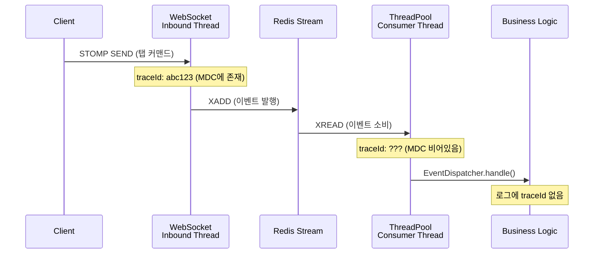
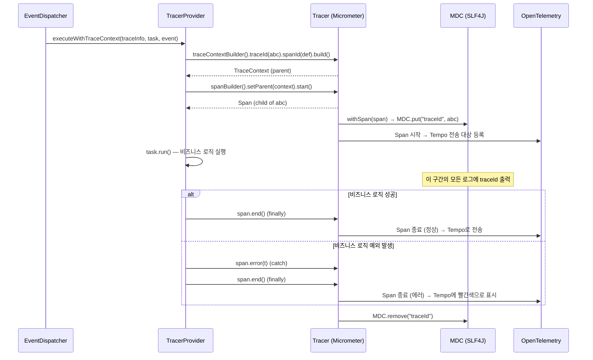

ZZOL의 모든 유저 액션은 Redis Stream을 경유한다. WebSocket으로 들어온 요청이 Redis Stream에 발행되고, 별도 스레드풀에서 소비되어 게임 로직이 실행된다. 이 구조에서 한 가지 문제가 있었다. 유저 요청의 시작부터 끝까지를 하나의 trace로 추적할 수 없었다.

## 분산 추적이 왜 필요한가

ZZOL은 실시간 멀티플레이어 게임 서비스다. 유저의 액션 하나가 처리되는 경로가 단순하지 않다.

```
Client → WebSocket → Inbound Thread → Redis Stream → Consumer Thread → Business Logic → WebSocket → Client
```

레이싱 게임에서 유저가 화면을 탭하면, 이 하나의 액션이 위 경로를 전부 타고 돌아온다. 경로 중 어디서든 지연이 발생하면 유저는 "탭했는데 반응이 없다"고 느낀다. 문제는 **어디서 느려졌는지를 찾는 것**이다.

분산 추적이 하는 일은, 이 경로의 모든 구간에 동일한 traceId를 달아서 **이 요청은 어떤 경로를 거쳤고, 각 구간에서 얼마나 걸렸는가**를 하나의 타임라인으로 볼 수 있게 하는 것이다. Tempo에서 traceId 하나로 검색하면 WebSocket 입구부터 비즈니스 로직 실행, 응답 전송까지의 전 구간이 Span 단위로 펼쳐진다.

traceId가 없으면 이런 일이 벌어진다.

**장애 원인 추적이 불가능하다.** 레이싱 게임 중 "탭 응답이 200ms 이상 걸린다"는 리포트가 들어왔다고 하자. E2E latency 메트릭으로 지연이 발생하고 있다는 건 알 수 있다. 하지만 그 지연이 WebSocket inbound 큐에서 걸린 건지, Redis Stream 발행에서 걸린 건지, Consumer 스레드풀 대기에서 걸린 건지, 비즈니스 로직 자체에서 걸린 건지를 구분할 수 없다. traceId가 있으면 Tempo에서 해당 요청의 Span 타임라인을 열어서 어느 구간이 병목인지 바로 특정할 수 있다.

**로그 추적이 끊어진다.** 유저 A의 방 입장 요청이 실패했다고 하자. WebSocket inbound 로그에서는 `[traceId=abc123]`으로 해당 요청을 필터링할 수 있다. 하지만 Consumer 스레드에서 찍힌 로그에는 traceId가 없다. Consumer 로그에서 같은 요청의 처리 로그를 찾으려면, 타임스탬프와 joinCode 같은 비즈니스 필드를 조합해서 수동으로 매칭해야 한다. 동시에 여러 요청이 처리되고 있으면 어떤 로그가 어떤 요청의 것인지 구분이 안 된다.

**에러 알림이 요청과 연결되지 않는다.** Consumer에서 예외가 발생해서 Sentry나 알림 시스템에 에러가 찍혔다고 하자. traceId가 없으면 이 에러가 어떤 유저의 어떤 액션에서 발생한 것인지를 알 수 없다. "RoomJoinConsumer에서 NPE가 발생했다"는 알 수 있지만, "유저 A가 방 B에 입장하려다가 터졌다"를 연결하려면 로그를 하나하나 뒤져야 한다.

ZZOL에는 이미 Redis Stream의 E2E latency 메트릭, 스레드풀 큐 깊이, Rate Limit 드롭 카운터 등 모니터링 지표가 세팅되어 있었다. "시스템 전체가 느려지고 있다"는 감지할 수 있었지만, "이 특정 요청이 어디서 느려졌는가"에 대한 답은 분산 추적 없이 불가능했다. 메트릭은 집계 데이터이고, 개별 요청의 경로를 추적하는 건 trace의 영역이다.

## 로그에 traceId가 안 찍힌다

ZZOL에는 이미 Micrometer Tracing + OpenTelemetry + Tempo 기반의 분산 추적이 세팅되어 있었다. 로그 패턴에도 `%X{traceId},%X{spanId}`가 들어 있었다.

```
%d{yyyy-MM-dd HH:mm:ss} [%thread] %-5level [%X{traceId:-},%X{spanId:-}] %logger{36} - %msg%n
```

HTTP 요청은 잘 찍혔다. Spring Boot Actuator가 HTTP 요청에 대해서는 자동으로 Observation을 열고, Micrometer Tracing이 MDC에 traceId를 넣어준다. 문제는 Redis Stream Consumer 스레드였다.

```
# WebSocket inbound 스레드 (traceId 있음)
2025-03-05 12:51:03 [inbound-1] INFO  [abc123,def456] RoomWebSocketController - 방 입장 요청

# Redis Stream consumer 스레드 (traceId 없음)
2025-03-05 12:51:03 [redis-stream-thread-pool-concurrent1] INFO  [,] RoomJoinConsumer - 플레이어 입장 처리
```

Consumer 스레드에서 traceId가 빈 값이다. Tempo에서도 WebSocket inbound 구간만 보이고, 그 뒤의 비즈니스 로직은 trace에서 사라진다.

유저가 "탭했는데 반응이 느리다"고 하면 WebSocket 입구까지는 추적이 되는데, 실제로 게임 로직이 돌아가는 Consumer 쪽은 안 보인다. 정작 문제가 발생하는 구간을 추적 못 하고 있었다.

## 왜 끊어지는가

원인은 스레드 경계다. ZZOL의 이벤트 처리 경로를 보면 스레드가 최소 두 번 바뀐다.



WebSocket inbound 스레드에서 Redis Stream으로 이벤트를 발행할 때, MDC에 들어 있는 traceId는 그 스레드의 `ThreadLocal`에 존재한다. Redis Stream에서 이벤트를 꺼내 처리하는 건 `ThreadPoolTaskExecutor`의 다른 스레드다. `ThreadLocal`은 스레드 간에 공유되지 않으므로, Consumer 스레드의 MDC는 비어 있다.

Spring Boot 3의 `ContextPropagatingTaskDecorator`나 `ContextSnapshotFactory`가 이 문제를 풀어주는 건 맞다. 하지만 전제 조건이 있다. **태스크를 submit하는 시점의 스레드에 이미 Observation(또는 Span)이 열려 있어야 한다.** Redis Stream의 `StreamMessageListenerContainer`는 Spring의 `@Async`와 달리, 내부적으로 Redis 커넥션을 폴링하는 별도 루프에서 메시지를 읽어온다. 이 폴링 스레드에는 Observation이 열려 있지 않다. `ContextSnapshotFactory`가 캡처할 context 자체가 없다.

## 선택지 세 가지

이 문제를 해결하는 방법을 세 가지 검토했다.

### 방법 1: Spring의 자동 전파에 맡기기

Spring Boot 3는 `micrometer-context-propagation` 라이브러리를 통해 `ThreadLocal` 기반 context를 스레드 간에 자동 전파하는 메커니즘을 제공한다. `TaskDecorator`에 `ContextSnapshotFactory.captureAll().wrap(runnable)`을 세팅하면, 태스크를 submit하는 시점의 `ThreadLocal` 값들이 실행 스레드로 전파된다.

문제는 "submit하는 시점에 전파할 context가 있어야 한다"는 점이다. Redis Stream 폴링 스레드에는 Observation이 없다. 빈 context를 전파해봐야 의미가 없다. `@Async`처럼 유저 요청 스레드에서 직접 submit하는 구조에서는 작동하지만, Redis Stream처럼 중간에 외부 시스템(Redis)을 경유하는 구조에서는 자동 전파만으로 해결되지 않는다.

단, 이 메커니즘 자체가 쓸모없는 건 아니다. Consumer 스레드 안에서 추가적인 비동기 작업(예: `@Async`로 QR 코드 생성)이 발생할 때, 복원된 trace context가 그 다음 스레드로 전파되려면 `TaskDecorator`가 필요하다. 1단계 전파는 못 하지만, 2단계 이후 전파에는 필요하다.

### 방법 2: 이벤트 payload에 traceId를 실어 보내기

Publisher에서 현재 스레드의 traceId/spanId를 추출해서 이벤트 객체에 필드로 담고, Redis Stream을 통해 JSON으로 직렬화해서 보낸다. Consumer에서 이벤트를 역직렬화한 뒤 필드에서 traceId를 꺼내 Span을 복원한다.

명시적이다. Redis를 경유하든 Kafka를 경유하든, 메시지 payload에 trace 정보가 들어 있으면 어디서든 복원할 수 있다. 외부 시스템의 전파 메커니즘에 의존하지 않는다.

단점은 모든 이벤트 DTO에 traceId/spanId 필드를 추가해야 한다는 점이다. 이벤트가 10개면 10개 다 수정해야 한다.

### 방법 3: Redis Stream 메시지 헤더에 넣기

Spring Data Redis의 `StreamRecords`는 `MapRecord`를 지원한다. 메시지의 key-value 필드에 `traceId`, `spanId`를 별도 엔트리로 넣는 방식이다. 이벤트 DTO를 건드리지 않아도 된다.

하지만 현재 ZZOL의 `StreamPublisher`는 `ObjectRecord`로 이벤트를 통째로 JSON 직렬화해서 하나의 value로 넣고 있다. `MapRecord`로 바꾸면 직렬화/역직렬화 구조를 전부 수정해야 한다. `RedisStreamListenerStarter`의 `onMessage()`, `ObjectMapper` 설정, 기존 테스트 전부가 영향 범위에 들어간다.

### 판단

**방법 2를 선택했다.** 이유는 세 가지다.

첫째, 기존 직렬화 구조를 건드리지 않는다. `StreamPublisher`와 `RedisStreamListenerStarter`의 `ObjectRecord` 기반 파이프라인은 그대로 유지된다. 이벤트 DTO에 필드를 추가하는 건 additive change여서 기존 코드를 깨뜨리지 않는다.

둘째, 명시적이다. trace 정보가 이벤트 객체의 필드로 존재하므로, 디버깅할 때 Redis CLI에서 `XRANGE`로 메시지를 조회하면 traceId가 바로 보인다. 헤더에 넣으면 이 가시성이 사라진다.

셋째, 방법 1의 `TaskDecorator`는 어차피 함께 적용한다. Consumer 스레드에서 trace를 복원한 뒤, 그 안에서 발생하는 추가 비동기 작업(`@Async`, outbound WebSocket 등)에 대한 전파는 `ContextSnapshotFactory`가 담당한다. 방법 2는 방법 1을 대체하는 게 아니라 보완하는 것이다.

## 구현: Publisher 측 — TraceInfoExtractor

이벤트 생성 시점에 현재 스레드의 trace context를 추출해야 한다. Micrometer Tracing에서 현재 traceId를 꺼내는 방법은 여러 가지가 있는데, `Tracer.currentSpan()`을 직접 쓰는 건 피했다.

이유가 있다. `TraceInfoExtractor`는 이벤트 DTO의 생성자에서 호출되는 static 메서드다. `Tracer`는 Spring Bean이므로 static 메서드에서 직접 접근하려면 static 브릿지가 필요한데, 이건 `ObservationRegistry`를 쓰든 `Tracer`를 쓰든 마찬가지다. 둘 다 Spring Bean이니까. 차이는 추상화 레벨이다. `Tracer`는 Micrometer Tracing의 구현체이고, `ObservationRegistry`는 tracing, metrics, logging을 통합하는 Spring Boot 3의 상위 추상화다. `Tracer`에 직접 의존하면 tracing 구현체에 결합되고, `ObservationRegistry`에 의존하면 Spring의 관측 인프라에 결합된다. 나중에 tracing 라이브러리를 교체하거나 metric과 통합할 때 후자가 유리하다. 솔직히 지금 당장은 동작이 똑같지만, Spring Boot 3의 Observation 체계를 따르는 쪽을 선택했다.

```java
public static TraceInfo extract() {
    try {
        final ObservationRegistry observationRegistry = ObservationRegistryProvider.getObservationRegistry();
        final Observation observation = observationRegistry.getCurrentObservation();
        final TracingContext traceContext = observation.getContext().get(TracingContext.class);
        return new TraceInfo(
                traceContext.getSpan().context().traceId(),
                traceContext.getSpan().context().spanId()
        );
    } catch (Exception e) {
        log.debug("Trace context 없음: {}", e.toString());
        return new TraceInfo("", "");
    }
}
```

`ObservationRegistryProvider`는 Spring Bean으로 생성될 때 `ObservationRegistry`를 static 필드에 저장하는 holder 클래스다. static 유틸리티에서 Spring Bean에 접근하기 위한 브릿지인데, 이 패턴은 명확한 트레이드오프가 있다. 테스트에서 `ObservationRegistry`를 교체하기 어렵고, 빈 초기화 순서에 의존한다. 그럼에도 불구하고 선택한 이유는, 이벤트 DTO가 record 타입이라 생성자에서 모든 필드를 초기화해야 하기 때문이다. 팩토리 메서드나 빌더로 우회할 수도 있지만, record의 간결함을 유지하는 게 더 낫다고 판단했다.

이 문제를 근본적으로 해결하려면, 이벤트 DTO 생성자가 아니라 이벤트를 발행하는 Publisher(Spring Bean) 계층에서 `TraceInfo`를 주입하는 팩토리 메서드 패턴을 고려할 수 있다. Publisher가 Spring Bean이므로 `Tracer`를 주입받을 수 있고, static 브릿지가 필요 없어진다. 다만 이 경우 이벤트 생성과 trace 주입의 책임이 분리되면서, "이벤트가 생성되는 곳이면 어디든 trace가 자동으로 붙는다"는 현재의 편의성을 잃는다. 이벤트 수가 늘어나면 이 트레이드오프를 다시 평가해야 할 것이다.

catch 블록에서 빈 `TraceInfo`를 반환하는 것은 의도적이다. Observation이 열려 있지 않은 컨텍스트(예: 스케줄러, 테스트)에서 이벤트를 생성할 때 NPE로 터지면 안 된다. trace 정보가 없으면 없는 대로 처리하고, Consumer 쪽에서 빈 `TraceInfo`를 감지하면 Span 복원 없이 task를 바로 실행한다.

이벤트 DTO는 이렇게 생겼다.

```java
public record RoomJoinEvent(
        String eventId,
        TraceInfo traceInfo,
        Instant timestamp,
        String joinCode,
        String guestName
) implements BaseEvent, Traceable {

    public RoomJoinEvent(String joinCode, String guestName) {
        this(
                UUID.randomUUID().toString(),
                TraceInfoExtractor.extract(),  // 여기서 현재 traceId를 캡처
                Instant.now(),
                joinCode,
                guestName
        );
    }
}
```

`Traceable` 인터페이스는 `traceInfo()` 메서드 하나만 가진다. `BaseEvent`와 분리한 이유는 모든 이벤트가 trace를 가지는 건 아니기 때문이다. 시스템 내부에서 생성되는 이벤트(스케줄러 기반 등)는 trace context가 없을 수 있다. `BaseEvent`에 `traceInfo()`를 강제하면 불필요한 빈 값을 다 넣어야 한다.

## 구현: Consumer 측 — TracerProvider

Consumer 쪽이 핵심이다. `EventDispatcher`에서 이벤트를 소비할 때, `Traceable` 이벤트면 trace context를 복원하고 Span을 열어야 한다.

처음에는 `EventDispatcher.handle()` 안에서 직접 MDC에 traceId를 넣으려고 했다. `MDC.put("traceId", traceInfo.traceId())`면 끝이니까.

```java
// 처음 시도 — MDC 직접 조작
MDC.put("traceId", traceable.traceInfo().traceId());
MDC.put("spanId", traceable.traceInfo().spanId());
try {
    consumer.accept(event);
} finally {
    MDC.clear();
}
```

이러면 로그에 traceId는 찍힌다. 하지만 Tempo에는 안 보인다. MDC에 값을 넣는 것과 Micrometer Tracing의 Span을 여는 건 다른 일이다. MDC는 로깅 프레임워크의 `ThreadLocal` 저장소일 뿐이고, Tempo로 trace 데이터를 보내려면 OpenTelemetry의 Span이 생성되어야 한다. MDC 직접 조작은 "로그에는 보이는데 Tempo에는 안 보이는" 반쪽짜리 해결이다.

`TracerProvider`를 만들어서 Micrometer `Tracer` API를 통해 Span을 생성하도록 했다.

```java
public void executeWithTraceContext(TraceInfo traceInfo, Runnable task, BaseEvent event) {
    if (!traceInfo.traceable()) {
        task.run();
        return;
    }
    final TraceContext context = tracer.traceContextBuilder()
            .traceId(traceInfo.traceId())
            .spanId(traceInfo.spanId())
            .sampled(true)
            .build();
    final Span span = tracer.spanBuilder()
            .name(event.getClass().getSimpleName())
            .setParent(context)
            .start();
    try (Tracer.SpanInScope spanInScope = tracer.withSpan(span)) {
        task.run();
    } catch (Throwable t) {
        span.error(t);
        throw t;
    } finally {
        span.end();
    }
}
```

`catch` 블록의 `span.error(t)`가 없으면 Tempo 대시보드에서 해당 Span이 정상(초록색)으로 표시된다. 비즈니스 로직에서 예외가 터졌는데 Span이 성공으로 찍히면, 장애 추적할 때 에러 Span만 필터링하는 게 불가능해진다. `span.error(t)`를 호출해야 Tempo에서 해당 Span이 에러 상태(빨간색)로 표시되고, `throw t`로 예외를 재전파해야 `EventDispatcher`의 외부 catch에서 에러 로그를 남길 수 있다. 처음에는 `finally`에서 `span.end()`만 했다가, Tempo에서 실패한 이벤트를 필터링할 수 없다는 걸 깨닫고 추가했다.

이 코드가 하는 일을 단계별로 정리하면 이렇다.



`tracer.withSpan(span)`이 핵심이다. 이 호출이 `SpanInScope`를 반환하면서, 내부적으로 두 가지를 한다. MDC에 traceId/spanId를 세팅하고, OpenTelemetry의 Context에 Span을 등록한다. `try-with-resources`로 감쌌으므로 `task.run()` 범위 안에서만 유효하고, 블록을 벗어나면 자동으로 정리된다. `finally`에서 `span.end()`를 호출하면 Span이 종료되고 Tempo로 전송된다.

`traceInfo.traceable()`이 false인 경우(traceId가 빈 문자열)에는 Span을 생성하지 않고 task를 바로 실행한다. Observation이 없는 컨텍스트에서 생성된 이벤트까지 빈 Span을 만들면 Tempo에 쓸모없는 데이터가 쌓인다.

`span.name()`에 `event.getClass().getSimpleName()`을 사용한 이유는 Tempo에서 검색할 때 이벤트 타입별로 필터링하기 위해서다. `RoomJoinEvent`, `TapCommandEvent` 같은 이름으로 Span이 보이면 어떤 유저 액션인지 바로 알 수 있다.

## EventDispatcher에서의 분기

`EventDispatcher.handle()`에서 `Traceable` 분기를 넣은 방식이다.

```java
public void handle(BaseEvent event) {
    try {
        recordLatency(event);

        final Consumer<BaseEvent> consumer = (Consumer<BaseEvent>) getConsumer(event.getClass());
        final Runnable handling = () -> consumer.accept(event);

        if (event instanceof Traceable traceable) {
            tracerProvider.executeWithTraceContext(traceable.traceInfo(), handling, event);
            return;
        }
        handling.run();

    } catch (Exception e) {
        log.error("이벤트 처리 실패: message={}", event, e);
    }
}
```

`instanceof Traceable` 패턴 매칭으로 분기한다. `Traceable`이 아닌 이벤트는 기존과 완전히 동일하게 실행된다. 새로운 기능을 추가하면서 기존 경로를 건드리지 않는 것이 중요했다. 이미 메트릭 수집을 위한 모니터링 코드가 이 경로에 들어가 있기 때문에, trace 복원 코드가 기존 로직의 동작을 변경하면 안 된다.

`TracerProvider.executeWithTraceContext()` 안에서 예외가 발생하면 어떻게 되는가? `tracer.traceContextBuilder()`나 `spanBuilder()`에서 터질 수 있다. 이 경우 `handle()`의 외부 catch가 잡는다. trace 복원 실패가 이벤트 처리 실패로 이어지는 건 맞는가?

여기서 판단이 갈렸다. 모니터링 글에서 `recordLatency()`를 별도 try-catch로 격리한 것처럼, `executeWithTraceContext()`도 격리해야 하지 않은가? 결론은 **격리하지 않았다.** 이유가 다르다. `recordLatency()`는 순수하게 부가 기능이다. 메트릭이 안 찍혀도 게임은 돌아가야 한다. 하지만 `executeWithTraceContext()`는 비즈니스 로직 실행(`task.run()`)을 감싸고 있다. 이 메서드 자체가 실패하면 비즈니스 로직이 실행 안 된 것이므로, 외부 catch에서 에러 로그를 남기는 게 맞다.

## TaskDecorator: 2단계 전파를 위한 설정

앞서 말했듯, `ContextSnapshotFactory`는 Redis Stream → Consumer 스레드 간의 1단계 전파를 해결하지 못한다. 하지만 Consumer 스레드 안에서 발생하는 추가적인 스레드 전환에는 필요하다.

ZZOL에서 이런 케이스가 실제로 있다. 방 생성 이벤트가 Consumer에서 처리될 때, QR 코드 생성이 `@Async`로 별도 스레드에서 실행된다. `TracerProvider`가 Consumer 스레드에 Span을 복원한 뒤, `@Async` 태스크가 submit되는 시점에 `TaskDecorator`가 이 Span을 캡처해서 QR 코드 생성 스레드로 전파해야 한다.

Redis Stream 스레드풀에 설정한 `TaskDecorator`다.

```java
executor.setTaskDecorator(runnable -> snapshotFactory.captureAll().wrap(runnable));
```

`captureAll()`은 현재 스레드의 모든 `ThreadLocal` 기반 context(Micrometer의 `ObservationThreadLocalAccessor`, SLF4J MDC 등)를 스냅샷으로 찍는다. `wrap(runnable)`은 실행 시점에 이 스냅샷을 복원하는 데코레이터를 만든다. 이 한 줄이 Redis Stream 풀, `@Async` 풀, WebSocket outbound 풀 전부에 동일하게 적용되어 있다.

## 결과

```
# Before — Consumer 스레드 traceId 없음
[redis-stream-thread-pool-concurrent1] INFO  [,] RoomJoinConsumer - 플레이어 입장 처리

# After — Consumer 스레드 traceId 복원됨
[redis-stream-thread-pool-concurrent1] INFO  [abc123,ghi789] RoomJoinConsumer - 플레이어 입장 처리
```

||Before|After|
|---|---|---|
|Consumer 로그 traceId|빈 값|Publisher의 traceId와 동일|
|Tempo trace 범위|WebSocket inbound까지만|Consumer 비즈니스 로직까지 연결|
|`@Async` 2단계 전파|끊어짐|`TaskDecorator`로 전파|

## 정리
![[Pasted image 20260306213049.png]]

Redis Stream을 경유하는 비동기 이벤트에서 trace context가 끊어지는 건, 스레드 경계 문제이면서 동시에 외부 시스템 경유 문제다. Spring의 `ContextSnapshotFactory` 기반 자동 전파는 `@Async`처럼 유저 요청 스레드에서 직접 submit하는 구조에서는 동작하지만, Redis Stream처럼 중간에 외부 시스템을 거치는 구조에서는 전파할 context 자체가 없다.

이 한계를 이벤트 payload에 traceId를 실어 보내는 방식으로 해결했다. Publisher에서 `TraceInfoExtractor`가 현재 Observation의 trace 정보를 추출하고, Consumer에서 `TracerProvider`가 Micrometer `Tracer` API로 Span을 복원한다. MDC 직접 조작이 아니라 `Tracer.withSpan()`을 사용한 이유는 로그와 Tempo 양쪽에 모두 trace가 전파되어야 하기 때문이다.

모든 스레드풀의 `TaskDecorator`에 `ContextSnapshotFactory`를 적용한 건 1단계 전파를 위한 게 아니라 2단계 이후 전파를 위한 것이다. Consumer 스레드에서 복원된 trace가 `@Async`, outbound WebSocket 등 후속 비동기 작업으로 이어지려면 이 설정이 필수다. 1단계와 2단계의 전파 메커니즘이 다르다는 걸 구분하는 게 중요했던 것 같다.