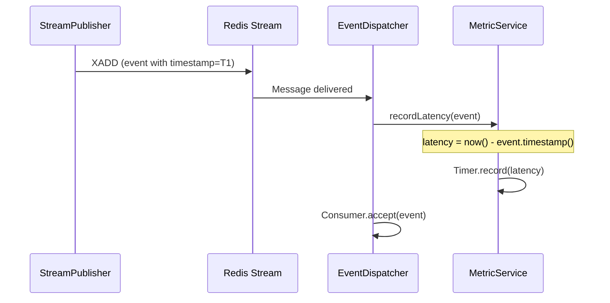
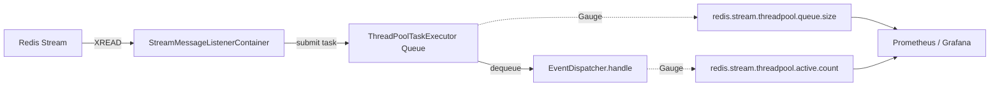

ZZOL의 모든 실시간 이벤트는 Redis Stream을 통해 흐른다. 방 입장, 카드 선택, 레이싱 탭 커맨드까지. 그런데 이 파이프라인에 대한 관측 지표가 하나도 없었다. 메시지가 100ms 늦게 도착해도, 스레드풀 큐가 80% 찼어도, 아무도 모르는 상태였다. 이 블라인드 스팟을 메트릭으로 채운 과정을 기록한다.

## 기존 모니터링이 놓치고 있던 것

Grafana 대시보드에는 CPU, Memory, JVM GC, HTTP latency, HikariCP 커넥션 풀, WebSocket 연결 수가 이미 있었다. 시스템 기본 지표와 HTTP 트래픽은 잘 보이는 상태였다. 하지만 ZZOL의 핵심 데이터 경로는 HTTP가 아니라 Redis Stream이다.

```
Client → WebSocket → Spring Boot → Redis Stream → EventDispatcher → Consumer → WebSocket → Client
```

유저의 게임 액션은 WebSocket으로 들어와서 Redis Stream에 발행되고, `EventDispatcher`가 소비해서 게임 로직을 실행한 뒤 결과를 다시 WebSocket으로 브로드캐스트한다. 이 경로에서 지연이 발생하면 유저는 "탭했는데 반응이 없다"고 느낀다. 그런데 이 경로의 어디에도 시간을 재는 코드가 없었다.

문제를 구체적으로 정리하면 네 가지였다.

첫째, Redis Stream 메시지의 발행~소비 간 End-to-End 지연 시간을 측정하고 있지 않았다. 레이싱 게임의 `TapCommandEvent`가 100ms 늦게 처리되면 유저 체감에 직결되는데, 이걸 감지할 방법이 없었다.

둘째, 컨슈머 스레드풀이 포화 직전인지를 알 수 없었다. 이벤트를 Redis에서 읽어왔지만 처리를 못 하고 큐에 쌓여 있는 상황을 감지할 수단이 없었다.

셋째, WebSocket Rate Limiter가 메시지를 드롭하고 있는데 그 횟수를 세지 않고 있었다. Rate Limit 임계치(초당 20건)가 적절한지 판단할 근거가 없는 상태였다.

넷째, 현재 동시에 진행 중인 게임이 몇 개인지 모르고 있었다. Room 상태별(READY, PLAYING, DONE) 활성 수는 시스템 부하의 직접적 지표인데 수집하지 않고 있었다.

## 어떤 지연을 측정할 것인가

Redis Stream의 "지연"에는 두 가지 관점이 있다. 시간적 지연과 공간적 지연이다.

시간적 지연은 메시지 하나가 발행된 시점부터 소비되는 시점까지 걸린 시간이다. 유저 체감과 직결된다. 공간적 지연은 아직 처리되지 않은 메시지가 얼마나 쌓여 있는가다. 시스템 포화도를 나타낸다.

둘 다 필요하지만 측정 방법이 다르다. 시간적 지연은 이벤트 단위로 발행~소비 시간차를 계산해야 하고, 공간적 지연은 주기적으로 시스템 상태를 폴링해야 한다.

코드를 분석하면서 발견한 게 하나 있었다. `BaseEvent` 인터페이스에 `timestamp()` 메서드가 이미 있었다. 모든 이벤트가 발행 시점을 `Instant`로 기록하고 있었다. 그런데 `EventDispatcher`에서 이 값을 소비 시점과 비교하는 코드가 없었다. 한 줄만 추가하면 E2E 지연 측정이 가능한 상태였는데 아무도 안 한 것이다.



## E2E Latency — Timer로 측정하기

`RedisStreamLatencyMetricService`를 만들어서 `EventDispatcher.handle()` 진입 시점에 지연을 기록하도록 했다. Micrometer의 Timer를 사용한다.

```java
public void recordLatency(BaseEvent event) {
    if (streamLatencyTimer == null) {
        return;
    }

    if (event.timestamp() == null) {
        return;
    }

    final Duration latency = Duration.between(event.timestamp(), Instant.now());

    if (latency.isNegative()) {
        log.warn("음수 지연 감지 (clock skew 의심): eventId={}, latency={}ms",
                event.eventId(), latency.toMillis());
        return;
    }

    streamLatencyTimer.record(latency);
}
```

음수 지연 체크가 있는 이유는 멀티 인스턴스 환경 때문이다. 발행 서버와 소비 서버의 시계가 다르면 `now() - timestamp`가 음수가 될 수 있다. NTP 동기화가 되어 있어야 하지만, 방어 코드는 넣어두는 게 맞다. 음수 지연을 Timer에 기록하면 p99 같은 통계가 왜곡된다.

Timer를 `publishPercentileHistogram()`으로 등록하면 Prometheus에 히스토그램 버킷이 노출된다. 이걸로 Grafana에서 p50, p95, p99를 PromQL로 계산할 수 있다.

```
histogram_quantile(0.95, sum(rate(redis_stream_e2e_latency_seconds_bucket[1m])) by (le))
```

### EventDispatcher에서의 격리

`EventDispatcher`에 `recordLatency()` 호출을 추가할 때 한 가지 판단이 필요했다. 메트릭 수집이 실패하면 이벤트 처리 전체가 죽어야 하는가?

답은 당연히 아니다. 메트릭은 부가 기능이다. Timer 초기화가 안 됐거나 Micrometer 내부에서 예외가 발생했다고 해서 게임 이벤트 처리가 멈추면 안 된다. 그래서 `recordLatency()`를 별도의 try-catch로 감싸서 격리했다.

```java
public void handle(BaseEvent event) {
    try {
        try {
            latencyMetricService.recordLatency(event);
        } catch (Exception e) {
            log.warn("Redis Stream 지연 메트릭 기록 실패: eventId={}", event.eventId(), e);
        }

        final Consumer<BaseEvent> consumer = (Consumer<BaseEvent>) getConsumer(event.getClass());
        // ... 이벤트 처리 로직
    } catch (Exception e) {
        log.error("이벤트 처리 실패: message={}", event, e);
    }
}
```

기존 catch가 이벤트 처리 전체를 감싸고 있었는데, 이 안에서 `recordLatency()`가 터지면 이벤트 처리까지 같이 catch되어 버린다. 메트릭 실패 로그가 찍히고 끝나야지, 게임이 멈추면 안 된다.

## Backpressure 지표 — XLEN이 Lag가 아닌 이유

E2E latency가 "메시지 하나가 얼마나 늦게 도착했는가"를 측정한다면, 그 다음으로 알아야 할 것은 "지금 시스템이 처리량을 감당하고 있는가"다. 처음에는 `XLEN`으로 스트림에 쌓인 메시지 수를 Lag 지표로 쓰려고 했다. Consumer Group 환경에서는 `XPENDING`으로 미처리 메시지 수를 구하지만, ZZOL은 Consumer Group을 쓰지 않으므로 `XLEN`이 대안이 될 수 있을 거라 생각했다.

결론부터 말하면, 틀렸다.

ZZOL의 스트림 발행 구조를 다시 보면, `StreamPublisher`에서 `XADD` 시 `MAXLEN ~ 100`으로 approximate trimming을 하고 있다. 컨슈머가 메시지를 처리해도 스트림에서 메시지가 지워지는 게 아니라, 발행 시점에 오래된 메시지가 잘리는 구조다. 그래서 컨슈머가 아무리 빨리 처리해도 `XLEN`은 항상 MAXLEN 근처를 유지한다. 반대로 컨슈머가 완전히 죽어서 메시지를 하나도 처리 못 해도 `XLEN`은 여전히 100이다.

```
XLEN in ZZOL's architecture:

  Consumer healthy, processing fast:   XLEN = ~100
  Consumer dead, processing nothing:   XLEN = ~100
  
  --> XLEN does NOT represent "unprocessed messages"
  --> XLEN represents "current stream history size"
```

`XLEN`은 "처리되지 않은 메시지 수"가 아니라 "스트림이 보유한 최근 이력의 크기"다. Lag 지표로 쓸 수 없다.

그렇다면 Redis 쪽에서 Lag를 구하는 것을 포기해야 한다. 대신 진짜로 메시지가 밀리고 있는지를 보여주는 곳이 있다. JVM 안의 스레드풀 큐다.

`EventDispatcher`가 Redis에서 메시지를 읽어온 뒤 즉시 처리하지 못하면, 해당 태스크는 `ThreadPoolTaskExecutor`의 작업 큐에 쌓인다. 큐가 비어있으면 시스템이 여유로운 것이고, 큐가 차고 있으면 처리 속도가 발행 속도를 따라잡지 못하는 것이다. 이것이 실제 Backpressure다.



스레드풀 큐 깊이와 활성 스레드 수를 Gauge로 등록했다. `ThreadPoolExecutor.getQueue().size()`와 `getActiveCount()`는 JVM 내부 호출이므로 Redis를 아예 치지 않는다. Prometheus scrape 주기(15초)에만 평가되므로 추가 부하도 없다.

참고로, Micrometer가 제공하는 `ExecutorServiceMetrics.monitor()`를 사용하면 큐 사이즈, 활성 스레드, 완료 태스크 수 등 스레드풀의 표준 지표들을 한 줄로 수집할 수 있다. 이번에는 스트림별 태그를 붙여서 "어떤 스트림의 풀이 포화인가"를 구분하기 위해 직접 Gauge를 등록했지만, 표준 지표만으로 충분한 경우라면 `ExecutorServiceMetrics`가 더 간결한 선택이다.

그런데 `XLEN`이 Lag가 아니라면 왜 수집은 남겨뒀는가? 스트림의 `MAXLEN` trimming이 정상 동작하는지 확인하는 용도다. **Lag 지표가 아니라, '스트림이 제한된 길이 내에서 적절히 유지되고 있는지'를 확인하는 시스템 헬스체크용 Gauge로 역할을 재정의했다.**
### 왜 스레드풀 큐가 진짜 위험 지표인가

ZZOL의 스트림 설정을 보면, 5개 스트림 중 3개(`room`, `minigame`, `racinggame`)가 `concurrent`라는 이름의 공유 스레드풀을 사용한다. 이 풀의 queue capacity는 1024다.

```yaml
redis.stream:
  thread-pools:
    concurrent: {core-size: 8, max-size: 16, queue-capacity: 1024}
  keys:
    "[room]": {thread-pool-name: concurrent}
    "[minigame]": {thread-pool-name: concurrent}
    "[racinggame]": {thread-pool-name: concurrent}
```

레이싱 게임에서 9명이 동시에 탭을 연타하면 `racinggame` 스트림의 이벤트가 급증한다. 이 이벤트들이 concurrent 풀의 큐를 빠르게 채우면, 같은 풀을 쓰는 `room`과 `minigame` 스트림의 이벤트 처리도 밀린다. 큐가 1024를 넘으면 `RejectedExecutionException`이 발생하고 이벤트가 유실된다.

스레드풀 큐 깊이를 모니터링하면 이 상황을 터지기 전에 감지할 수 있다. 큐 사용률이 50%를 넘으면 경고, 80%를 넘으면 위험이라는 기준을 잡을 수 있다.

## Rate Limit 드롭 카운터

WebSocket Rate Limiter는 세션당 초당 20건을 초과하는 메시지를 드롭한다. 드롭은 인터셉터에서 `null`을 반환하는 것으로 조용히 처리된다. [[rate_limiting]]에서 다뤘듯이, 서버 보호가 목적인 Rate Limiter가 초과 메시지마다 에러 응답을 보내면 outbound 스레드가 점유되어 본말전도가 된다.

문제는 드롭이 얼마나 발생하고 있는지 모른다는 것이었다. Rate Limit 임계치 20건이 적절한지 판단하려면, 실제로 드롭되는 비율을 알아야 한다. 드롭률이 0.1%면 임계치가 충분히 여유롭다는 뜻이고, 20%면 정상 유저까지 걸리고 있다는 뜻이다.

`WebSocketRateLimiter`의 `tryAcquire()`에 Micrometer Counter를 추가했다. false가 반환될 때만 increment하므로 정상 트래픽에서는 추가 비용이 없다.

```java
public boolean tryAcquire(String sessionId) {
    final SessionCounter counter = sessionCounters.computeIfAbsent(
            sessionId, k -> new SessionCounter(clock.millis())
    );
    boolean allowed = counter.tryAcquire(maxMessagesPerSecond, clock.millis());
    if (!allowed && rateLimitDropCounter != null) {
        rateLimitDropCounter.increment();
    }
    return allowed;
}
```

기존 `WebSocketRateLimiter`는 생성자에서 `MeterRegistry`를 받지 않았다. `MeterRegistry` 의존성을 추가하면서, 기존 테스트 코드가 깨지지 않도록 생성자 오버로딩으로 처리했다. 테스트에서 사용하는 2인자 생성자(`int`, `Clock`)는 내부적으로 `MeterRegistry`에 null을 전달하고, Counter가 null이면 increment를 건너뛴다.

PromQL에서 드롭 비율을 계산하면 이렇게 된다.

```
sum(rate(websocket_ratelimit_dropped_total[1m]))
  / sum(rate(websocket_messages_inbound_total[1m])) * 100
```

## Room 상태별 활성 수

마지막은 도메인 지표다. `MemoryRoomRepository`는 `ConcurrentHashMap`으로 Room을 인메모리 관리한다. 여기서 상태별(READY, PLAYING, SCORE_BOARD, ROULETTE, DONE) 카운트를 뽑으면, 지금 동시에 게임이 몇 판 진행 중인지 알 수 있다.

이 지표가 중요한 이유는 다른 지표들의 원인을 설명해주기 때문이다. E2E latency가 갑자기 튀거나 스레드풀 큐가 급증했을 때, PLAYING 상태 Room 수가 같이 증가하고 있으면 "동시 게임 수 증가 → 이벤트 폭증 → 처리 지연"이라는 인과를 파악할 수 있다. 이 지표 없이는 "느려졌는데 왜?"에 대한 답을 찾기 어렵다.

`MemoryRoomRepository`에 `countByState(RoomState)`와 `totalCount()` 메서드를 추가하고, `RoomActiveMetricService`에서 각 상태별 Gauge를 등록했다. Room 수가 수백 개 이하이므로 `ConcurrentHashMap` 순회 비용은 Prometheus scrape당 마이크로초 수준이다.

## 성능 영향 분석

모니터링 코드가 본 서비스에 부하를 주면 본말전도다. 추가된 비용을 항목별로 정리한다.

||추가 비용|빈도|영향|
|---|---|---|---|
|E2E Latency (Timer)|`Instant.now()` + `Duration.between()`|이벤트 소비마다|나노초 단위, 기존 `WebSocketMetricService`와 동일 패턴|
|XLEN 조회|Redis O(1) 연산|Prometheus scrape 주기 (15s)|초당 ~0.33 요청, GET 한 번 수준|
|스레드풀 큐 조회|JVM 내부 메서드 호출|Prometheus scrape 주기 (15s)|네트워크 비용 0|
|Rate Limit Counter|`Counter.increment()`|드롭 시에만|정상 트래픽에서 호출 안 됨|
|Room Gauge|`ConcurrentHashMap.values().stream()`|Prometheus scrape 주기 (15s)|마이크로초 단위|

Prometheus TSDB 관점에서는 히스토그램 버킷 약 70개 + Gauge/Counter 시리즈 약 25개가 추가된다. retention 7일, 3GB 제한 기준으로 전체 TSDB 용량의 1% 미만이다.

히스토그램 버킷이 부담되면 `publishPercentileHistogram()`을 빼고 `publishPercentiles(0.5, 0.95, 0.99)`만 남길 수 있다. 단, 클라이언트 사이드 percentile은 여러 인스턴스 합산이 안 되므로 스케일아웃 시에는 히스토그램이 필요하다. 현재 단일 인스턴스이므로 두 옵션 모두 유효하다.

## 결과

||Before|After|
|---|---|---|
|Message latency|unmeasured|p50/p95/p99 Timer|
|Thread pool saturation|unmeasured|queue size + active count Gauge|
|Rate limit drops|unmeasured|Counter per drop|
|Active games|unmeasured|Gauge per RoomState|

Added 7 Prometheus metrics in total: `redis_stream_e2e_latency_seconds`, `redis_stream_length`, `redis_stream_threadpool_queue_size`, `redis_stream_threadpool_active_count`, `websocket_ratelimit_dropped_total`, `room_active_count`, `room_total_count`.

## 정리
![[Pasted image 20260305215442.png]]
모니터링의 가치는 장애가 터진 후 원인을 찾는 것보다, 터지기 전에 징후를 감지하는 데 있다. Redis Stream E2E latency는 유저 체감 저하의 직접 지표이고, 스레드풀 큐 깊이는 이벤트 유실의 선행 지표다. 둘 다 없으면 "느려졌는데 왜?" "메시지가 안 왔는데 어디서 씹혔는지 모르겠다"에 답할 수 없다.

측정 포인트를 고를 때는 기존 코드에 이미 있는 걸 먼저 봐야 한다. `BaseEvent.timestamp()`가 모든 이벤트에 발행 시점을 기록하고 있었지만, 소비 시점에서 이 값을 활용하는 코드가 없었다. 한 줄 추가로 E2E latency 측정이 가능해진 건, 인프라를 새로 붙인 게 아니라 이미 있는 데이터를 활용한 것이다.

지표를 설계할 때는 자기 시스템의 구조적 특성을 제대로 이해해야 한다. Consumer Group 없이 `fromStart()` + `MAXLEN` trimming을 쓰는 구조에서 `XLEN`은 Lag가 아니라 스트림 이력 크기일 뿐이다. 이걸 Lag라고 착각하면 컨슈머가 죽어도 "정상"으로 보이는 대시보드를 만들게 된다. 진짜 Backpressure는 스레드풀 큐에서 보인다.

메트릭 수집 코드는 부가 기능이다. 이게 실패해서 핵심 비즈니스 로직이 죽으면 안 된다. `EventDispatcher`에서 메트릭 기록을 별도 try-catch로 격리한 것처럼, 관측 레이어와 비즈니스 레이어의 장애 전파를 끊어두는 것이 중요하다.

마지막으로, 도메인 지표(Room 상태별 활성 수)는 시스템 지표의 원인을 설명해주는 역할을 한다. latency 스파이크나 큐 포화가 발생했을 때, PLAYING Room 수가 같이 증가하고 있는지를 보면 "왜?"에 대한 답이 바로 나온다. 시스템 지표만으로는 현상만 보이고, 도메인 지표가 있어야 원인까지 보인다.