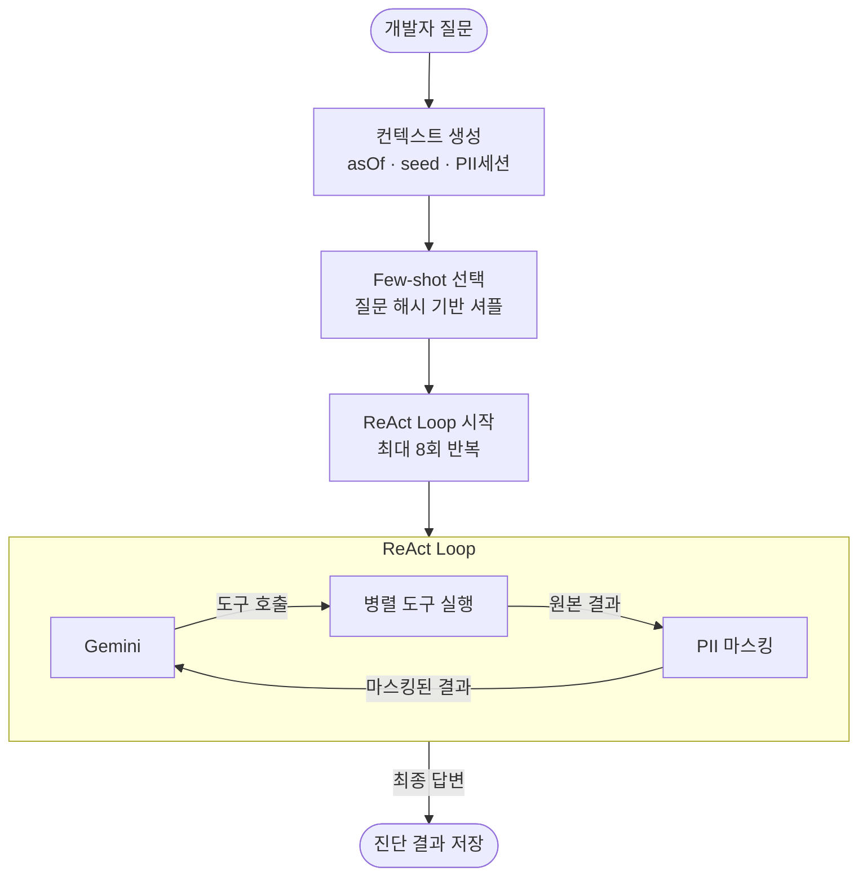
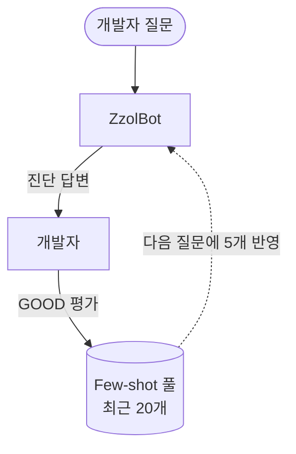

"A4BX 방 멈췄어요."

이 다섯 글자가 올라오면 개발자는 하던 작업을 멈추고 그라파나를 열었다. joinCode로 검색하고, Tempo에서 마지막 요청 흐름을 따라가고, Redis Stream lag을 확인했다. 한 번에 10분, 하루에 몇 번씩 코드를 짜다 멈추고, 디버깅하다 멈추고, 이 동선을 반복했다.

이 반복을 없애고 싶었다. 개발자가 자연어로 던지면 봇이 알아서 도구를 호출하고 진단 결과를 돌려주는 구조를 만들고 싶었고, 그 결과가 ZzolBot이다.

이번 글의 출발점은 토스플레이스 데이터 분석 팀의 [데이터봇 '판다(PANDA)'](https://toss.tech/article/da-assistant-panda) 도입기였다. 판다는 데이터 분석가의 ad-hoc 분석 요청을 LLM에게 위임한 사례다. 우리는 데이터가 아니라 운영 모니터링 스택이 문제였지만, "반복 패턴을 봇에게 넘긴다"는 아이디어는 같았다.

## 개발자가 매번 반복하는 동선

ZzolBot이 나오기 전, 두 가지 상황이 반복됐다.

**"방이 멈췄어요" 한 줄이 오면 모니터링 탭을 처음부터 열어야 했다.** "B7CD 방 미니게임이 진행이 안 돼요" 제보가 들어오면 그라파나를 열고 joinCode로 검색하고, Tempo에서 마지막 요청 흐름을 따라가고, Redis Stream lag이 쌓여있는지 보고, outbox 이벤트 테이블에 PENDING 레코드가 남아있는지 확인했다. 문제가 어디서 터졌는지 파악하는 데만 10~20분이 사라졌다. 하던 작업을 멈추고, 탭을 열고, 같은 동선을 다시 밟는 일이 하루에 몇 번씩 반복됐다.

**단순한 숫자 하나도 서버에 직접 붙어야 알 수 있었다.** "지금 가입한 유저가 몇 명이에요?" 같은 질문에 답하려면 SSH로 운영 서버에 접속하고, mysql을 띄우고, 직접 쿼리를 날려야 했다. 진단도 아니고 단순 데이터 추출인데, 그 경로가 너무 길고 오래걸렸다.

두 가지 모두 **데이터가 없어서가 아니었다.** 필요한 정보는 이미 시스템 안에 있었다. 다만 꺼내는 경로가 사람의 손을 거쳐야 했고, 그 손이 매번 같은 동선을 반복하고 있었다. 그 반복을 자동화하는 게 ZzolBot의 출발점이었다.

## ZzolBot이 가진 도구 7개

ZzolBot은 7개 도구를 통해 운영 데이터에 접근한다. 도구마다 연결하는 시스템이 다르다.

| 도구 | 역할 | 연결 |
|---|---|---|
| `room_state` | joinCode로 방 상태·플레이어 조회 | 운영 DB |
| `outbox_events` | 이벤트 유실·재시도 실패 조회 | 운영 DB |
| `sql_query` | 운영 통계 SQL 자유 조회 | 운영 DB |
| `redis_stream_status` | Redis Stream 적재량 조회 | Redis |
| `loki_logs` | 시간 범위 + joinCode 에러 로그 조회 | Loki API |
| `tempo_traces` | 요청 흐름·소요 시간 분석 | Tempo API |
| `prometheus_query` | PromQL 메트릭 수치 조회 | Prometheus API |

도메인 도구 세 개(room_state, outbox_events, sql_query)는 운영 DB에 직접 쿼리한다. 이전에 개발자가 SSH로 붙어 실행하던 작업을 도구로 위임한 것이다. 나머지 네 개는 이미 구축해둔 모니터링 스택에 HTTP API나 Redis 클라이언트로 연결했다. 새로 인프라를 추가하지 않고 기존 스택 위에 도구를 꽂는 방식이다.

## ZzolBot은 어떻게 동작하는가

ZzolBot은 질문을 받으면 LLM(Gemini)이 도구를 호출하고, 결과를 본 뒤 다음 행동을 결정하는 흐름을 반복한다. 사람이 그라파나를 열고, Tempo를 확인하고, DB를 조회하는 동선을 LLM이 대신 밟는다. 우리가 한 일은 LLM에게 도구를 쥐어주고, 그 도구가 안전하게 동작하도록 주변 가드를 박는 것이다.

전체 흐름은 다음과 같다.

## 만들어보고 나서야 알았던 것들

처음엔 단순하게 생각했다. LLM에게 도구들을 주고 질문을 던지면 진단이 끝날 것 같았다.

실제로 만들어보니 세 가지 문제가 바로 드러났다.

**LLM이 도구를 너무 많이 불렀다.** 방 상태 하나 확인하는 데 room_state, redis_stream_status, loki_logs, tempo_traces를 한꺼번에 호출했다. 필요 없는 도구까지 전부 불러 응답 시간이 20초를 넘겼다. 직접 그라파나 여는 것보다 기다리는 시간이 더 길었다.

**같은 질문에 다른 진단이 나왔다.** "A4BX 방 상태 알려줘"를 오전에 물으면 outbox 이벤트부터 보고, 오후에 물으면 redis stream부터 봤다. 진단 순서가 달라지면 결론도 달라진다. 운영봇은 같은 질문에 다른 답이 나오는 순간 신뢰를 잃는다.

**LLM이 만든 SQL을 그냥 실행할 수 없었다.** 초기 테스트에서 LLM이 민감한 인증 테이블을 조회하는 SQL을 만들었다. LLM이 생성한 SQL을 검증 없이 실행하는 건 운영 DB를 열어두는 것과 다름없었다.

이 세 가지가 먼저 풀리지 않으면 봇이 운영 환경에 들어갈 수 없었다. 핵심 기능들은 대부분 이 실패에서 시작됐다.

## 핵심 기능

### 질문 유형에 따라 도구를 다르게 쓴다

도구를 어떻게 선택할지는 시스템 프롬프트에 명시했다. 방 코드(joinCode)가 있는 질문이면 room_state부터 호출하고, 통계·집계 질문이면 sql_query를 쓰고, 시스템 전반 상태 질문이면 방 코드 없이 redis, prometheus, loki를 본다. LLM이 질문 맥락을 보고 스스로 판단하는 게 아니라, 우리가 결정 트리를 프롬프트에 명시해두고 LLM이 그 트리를 따르게 만들었다.

도구가 7개뿐이라는 것 자체가 설계 결정이다. 도구가 적을수록 LLM이 잘못된 선택을 할 경우의 수가 줄고, 봇의 동선을 예측할 수 있다.

### 운영 용어를 LLM이 이해하게 만들었다

"방 상태가 PLAYING이에요"가 무슨 뜻인지 LLM은 모른다. "DEAD_LETTER"가 무엇을 의미하는지도 모른다. 시스템 프롬프트에 zzol의 도메인 사전을 박았다.

- joinCode: 4자리 방 입장 코드 (대문자+숫자, 예: A4BX)
- 방 상태 라이프사이클: READY → PLAYING → SCORE_BOARD → ROULETTE → DONE
- 미니게임 종류: CARD_GAME, RACING_GAME, LADDER_GAME, SPEED_TOUCH, BLOCK_STACKING, BLIND_TIMER
- DEAD_LETTER: 재시도를 모두 소진하고 최종 실패한 이벤트

평소 쓰는 말 그대로 던져도 LLM이 어느 도구를 호출해야 하는지 추론할 수 있다. 토스 판다 글에서 "비즈니스 언어를 데이터와 연결하기"로 정리한 부분과 같은 작업이다.

### 같은 질문엔 같은 진단 결과가 나와야 한다

운영봇은 같은 질문에 다른 답이 나오면 신뢰를 잃는다. 초기 버전에서 진단 순서가 바뀌면서 결론이 달라지는 문제가 있었다. ZzolBot은 세 가지로 이를 고정한다.

- LLM의 창의성을 최소화하는 수치(temperature 0.1, topP 0.1)를 설정한다
- LLM 호출마다 고정 seed를 주입한다. seed는 `질문 텍스트 + 선택된 few-shot 예시 ID + 분 단위로 자른 시각`을 조합해 계산한다
- asOf를 분 단위로 자른다. 짧은 시간 내 같은 질문은 같은 답(신뢰성), 한참 뒤 같은 질문은 다른 답(현실 반영). 그 절충점이다

완전히 고정된 0을 쓰지 않는 이유는 Gemini API가 seed를 줘도 완전 결정적이지 않고, 도구 호출의 미세한 다양성을 남겨두기 위함이다.

### 개인정보는 LLM에 넘어가기 전에 치환한다

외부 LLM(Gemini)에 운영 데이터를 전달해야 하므로 이메일, IP 주소 같은 개인정보 처리가 필수다. ZzolBot은 단순 마스킹(`***`) 대신 결정론적 토큰화 방식을 쓴다.

세션 내에서 같은 이메일은 항상 같은 토큰(`[EMAIL_a3f9]`)으로, 같은 IP는 항상 같은 토큰(`[IP_2b1c]`)으로 치환한다. 단순 마스킹과 달리 LLM이 "이게 같은 사용자의 연속 행동인지"를 추론할 수 있다. 동시에 원본 값은 외부로 흘러나가지 않는다.

세션이 끝나면 토큰 매핑이 사라지고, 세션마다 seed가 달라서 같은 이메일이어도 세션이 다르면 다른 토큰이 된다. 답변이 유출되어도 다른 세션의 기록과 연결할 수 없다.

PII 마스킹은 도구 결과가 LLM에 전달되기 전에 한 번, 최종 답변을 DB에 저장할 때 한 번 더 적용된다. 도구가 원본 데이터를 꺼내왔어도 LLM과 저장소 양쪽 모두 원본을 볼 수 없다.

### LLM이 만든 SQL은 4겹 검증을 거친다

초기 테스트에서 LLM이 민감한 인증 테이블을 조회하는 SQL을 만들었다. LLM이 생성한 SQL을 검증 없이 실행하면 어느 테이블이 노출될지 보장할 수 없다. `sql_query` 도구는 다음 4겹 방어를 거친다.

1. **단일 SELECT만 허용** — SQL 문법 파서(JSqlParser)로 파싱해서 단일 SELECT가 아니면 거부한다. INSERT/UPDATE/DELETE/DROP은 물론, 여러 구문을 이어붙인 형태도 자연스럽게 차단된다
2. **테이블 화이트리스트** — 허용 목록에 명시한 테이블만 통과한다. 민감한 인증·OAuth 관련 테이블은 처음부터 목록에 없다
3. **컬럼 블랙리스트** — provider_user_id, refresh_token 같은 민감 컬럼은 테이블이 허용됐어도 개별 차단한다
4. **전체 조회 금지 + LIMIT 자동 보정** — `SELECT *` 같은 와일드카드는 허용하지 않고 컬럼을 직접 명시해야 한다. LIMIT이 없거나 허용치를 초과하면 자동으로 1000행으로 제한한다

이 가드 덕에 직접 DB에 붙는 것보다 ZzolBot을 통한 조회가 오히려 안전하다. 직접 접속이라면 어느 테이블이든 어느 컬럼이든 볼 수 있지만, ZzolBot 경로는 화이트리스트 밖으로 나갈 수 없다.

### 봇의 실행이 메인 서비스에 영향을 주지 않는다

실시간 미니게임 서비스에서 ZzolBot이 LLM 호출과 도구 실행을 병렬로 반복할 때, 그 부하가 게임 서버에 영향을 줘서는 안 된다. 두 가지로 격리했다.

도구 실행은 Tomcat 웹 서버의 스레드풀과 물리적으로 분리된 별도 가상 스레드 풀에서 처리된다. 봇이 아무리 많은 도구를 동시에 호출해도 게임 요청을 처리하는 스레드를 점유하지 않는다.

DB 쿼리 쪽은 이중으로 막았다. sql_query 도구가 실행하는 쿼리에는 MySQL 엔진 수준의 실행 시간 제한(`MAX_EXECUTION_TIME`)을 힌트로 주입한다. 쿼리가 오래 걸려도 DB 엔진이 직접 강제 종료하기 때문에 커넥션을 장시간 점유하지 않는다. Spring 트랜잭션 타임아웃도 함께 걸어 이중으로 방어했다.

### 최대 8번 반복하고 빠르게 실패를 알린다

LLM이 도구를 호출하고 결과를 보고 다음 행동을 결정하는 반복이 무한하게 돌면 안 된다. ZzolBot은 최대 8회로 제한한다. 8이라는 숫자는 도구 수에서 도출했다. 도구가 7개이므로 최악의 경우 각 도구를 개별 반복으로 호출해도 7번, 여기에 최종 답변 생성까지 포함하면 8이 자연스러운 상한이다. 8회는 실제 운영에서 여유롭게 동작할 수 있도록 잡아둔 상한선이다.

8회를 초과하면 "분석이 복잡하여 완료하지 못했습니다. 질문을 더 구체적으로 해주세요"를 돌려준다. 끝까지 돌게 두는 것보다 빠르게 실패를 알리는 게 낫다.

### 좋다고 한 답변이 다음 답변을 만든다

ZzolBot은 정적인 예시를 쓰지 않는다. 팀이 👍를 누른 답변 최근 20개를 풀로 두고, 다음 질문 때 그 풀에서 5개를 골라 "이런 질문엔 이렇게 답한다"는 예시로 LLM에 함께 넣는다.

5개를 고르는 방식도 결정적이다. 질문 텍스트를 seed로 풀을 섞어서 앞 5개를 가져온다. 같은 질문엔 항상 같은 5개가 선택되므로 결정론이 유지된다.

봇이 좋은 답을 낼수록 풀이 좋아지고, 풀이 좋아질수록 봇이 좋아진다. 자기강화 루프다.

### 답변 포맷을 강제한다

진단이 정확해도 포맷이 매번 다르면 검증하기 어렵다. 시스템 프롬프트에서 두 가지 포맷을 강제했다.

- **방 진단**: 진단 결과 → 조회 기준 → 추정 원인
- **통계 조회**: 조회 결과 → 조회 기준(사용한 SQL, 도구 목록)

조회 기준에는 항상 asOf(분석 기준 시각), requestId, 사용한 도구 목록이 들어간다. 같은 시점에 다시 확인하거나 다른 팀원이 검증할 때 그대로 재현할 수 있게 만드는 장치다.

## 실제로 어떻게 쓰이나
위에서 예시로 든 것처럼, "현재 회원가입한 유저 수 알려줘"라고 물으면, 직접 쿼리를 만들어서 날리고 아래와 같이 응답을 준다.
![[Pasted image 20260511234255.png]]

현재 특정방에 일어나고 있는 일에 대해 물어도, room_state 기능을 호출해서 joincode=L6UX로 DB를 조회해서 저 방에 대한 상태를 분석해서 답변을 준다.
![[Pasted image 20260511234530.png]]

기존이라면 작업 컨텍스트를 끊고 모니터링 동선을 처음부터 밟는 데 15분. 봇은 40초 내외다. 블랙박스가 아니라는 점도 중요하다. 봇이 어느 도구를 확인했는지 답변 안에 그대로 남기 때문에, 진단 결과가 의심스러우면 직접 같은 동선을 따라가볼 수 있다.

## 팀의 반응

ZzolBot을 팀에 배포하고 나서 가장 많이 쓰인 건 단순 상태 조회였다.

"친구 추가 기능이 안돼요!" 같은 CS 문의가 들어오면 이전에는 직접 SSH로 서버에 붙어 mysql을 실행했다. ZzolBot의 sql_query 도구가 이 패턴을 흡수하면서, 단순 상태 조회 때문에 작업 흐름이 끊기는 빈도가 눈에 띄게 줄었다.

## 앞으로

ZzolBot은 아직 읽기 전용 도구만 가지고 있다. 자주 반복되는 운영 조치(특정 방 강제 종료, 이벤트 재발행 트리거 등)는 다음 단계로 검토 중이다. 단, 쓰기 권한은 반드시 개발자 confirm 한 단계를 두려고 한다. 봇이 잘못된 판단을 내렸을 때 개발자가 마지막 안전망이어야 한다고 생각한다.

미니게임별 진단 노하우를 프롬프트에 더 박을 계획이다. 지금은 "이벤트가 유실됐으면 Outbox를 보고, 처리가 지연됐으면 Redis Stream을 확인한다"는 일반적인 진단 흐름으로 풀고 있지만, "Racing Game에서 disconnect가 자주 발생하면 X를 먼저 봐라" 같은 게임별 패턴을 넣으면 진단 정확도가 더 올라갈 것이다.

결국 운영봇이 잘 크려면 **피드백 루프가 살아 있어야 한다.** 팀의 GOOD/BAD 평가가 다음 답변을 만든다는 사실을 계속 인식시키는 작업이 남아 있다.

## 마무리

ZzolBot을 만들면서 가장 크게 느낀 건, 운영봇이 운영 환경에 올라가기 위해 결정적으로 필요했던 게 더 좋은 모델이 아니라는 점이다.

처음 만든 버전은 동작했지만 운영에 올릴 수 없었다. LLM이 필요 없는 도구를 너무 많이 호출했고, 같은 질문에 다른 진단이 나왔고, 민감한 테이블에 접근하는 SQL을 만들었다. 모델이 똑똑한 것과 봇이 안전한 것은 다른 문제였다.

도구 7개의 경계, 결정론 보장, PII 토큰화, SQL 4중 가드. 이것들이 ZzolBot을 운영 환경에 올릴 수 있게 한 결정적인 요소였다.

AI를 잘 활용한다는 게 꼭 가장 좋은 모델을 쓴다거나 가장 복잡한 프롬프트를 짠다는 의미는 아니다. 결국 중요한 건 도메인의 실제 Pain Point를 정확히 짚고, LLM이 그 자리에서 안전하게 동작할 수 있도록 주변을 깎는 작업이었다. ZzolBot도 그 과정의 한 결과물이다.
