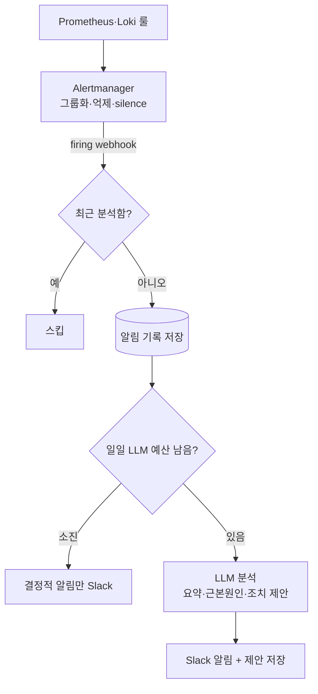

"A4BX 방 멈췄어요" 한 줄이 올라오면 [[zzolbot]]이 알아서 도구를 돌려 진단해준다. 덕분에 운영 진단은 한결 수월해졌지만, 뒤집어 보면 그 한 줄이 올라오지 않는 한 봇은 아무것도 하지 않는다는 뜻이기도 했다.

누가 물어봐야만 움직이는 ZzolBot은 결국 사람이 이상을 먼저 알아챈 다음에야 입을 연다. 새벽에 outbox가 쌓이고 있어도 아무도 묻지 않으면 봇은 그 사실조차 알지 못한다.

요즘 LLM을 서비스에 들이는 곳이 부쩍 늘었다. 나도 여기에 관심이 생겨 LLM을 똑똑하게 써보려 하는데, 그러면서 가장 중요하게 보게 된 건 하나다 — **한정된 한도 안에서 정확한 결과물을 뽑아내는 것.** 이번 능동 모니터링도 결국 그 고민을 운영 알림에 적용한 기록이다.

## 진단봇의 한계 — 물어봐야 움직인다

[[zzolbot]]도 [[zzolbot_eval_harness]]도 공통된 전제가 있었다. **사람이 봇에게 물어봐야 한다는 것.** 운영자가 "뭔가 이상한데?" 하고 인지한 다음에야 봇이 도구를 돌려 진단한다.

문제는 장애가 사람의 인지를 기다려주지 않는다는 거다. 이벤트 처리가 밀려 컨슈머 큐가 차거나 outbox가 DEAD_LETTER로 빠지는 건 대시보드를 들여다보는 사람이 없으면 한참 뒤에야 발견된다. 진단을 LLM에게 위임해놓고도, 정작 "언제 진단할지"는 여전히 사람 몫이었다.

봇이 먼저 감지하게 만들려면 사람의 질문을 대신할 무언가가 쉼 없이 돌아야 한다. 그런데 여기서 두 번째 제약이 걸린다. LLM을 쓴다는 건 결국 한정된 토큰 예산 안에서 쓸 만한 결과물을 뽑아내는 일이다. 토큰도 호출 한도도 무한하지 않으니, 사람이 부를 때만 돌던 진단과 달리 상시 돌아가는 작업에서 매번 LLM을 부르면 예산은 금세 바닥난다. 능동 감시의 어려움은 감지 자체보다 "한정된 예산을 어디에 쓰느냐"에 있었다.

그래서 목표는 두 가지로 모인다.

> **이상을 사람이 알아채기 전에 먼저 감지하면서도, LLM은 꼭 필요한 순간에만 최소한으로 부른다.**

## 그냥 LLM한테 다 맡기면 안 될까

출발점은 이미 깔려 있는 알림이다. Prometheus·Alertmanager가 "5xx가 N개 넘으면 알림" 식으로 이상을 탐지해 Slack에 쏜다. 싸고 빠르지만 숫자만 알려줄 뿐 맥락이 없다. "5xx 60건"이라는 알림을 받아도 왜 났는지, 뭘 해야 하는지는 결국 사람이 처음부터 파헤쳐야 한다. **이 비어 있는 맥락이 LLM으로 메우려는 자리다.**

그럼 그 맥락을 어떻게 붙일까. 세 가지를 놓고 고민했다.

**대안 1 — 매 주기 모든 신호를 LLM에게 통째로 분석시킨다.** 주기적으로 로그·메트릭·큐 상태를 모아 LLM에게 "이상한 거 있어?"를 물어보는 방식이다. 가장 똑똑해 보이지만, 평상시에도 LLM을 쉼 없이 부른다. 운영 신호는 99%가 정상인데, 그 정상을 확인하려고 매번 예산을 태우면 정작 이상일 때 쓸 게 남지 않고 무료 한도·쿼터에도 금방 부딪힌다. 채택하지 않았다.

**대안 2 — ZzolBot이 직접 주기적으로 신호를 점검한다.** 4시간마다 크론으로 로그·메트릭·큐를 직접 모아 임계값으로 판정하고, 이상이면 그때만 LLM을 부르는 방식이다. "평상시 LLM 0회"라는 목표는 이걸로도 이룬다. 하지만 두 가지가 걸렸다. 그 임계 판정은 Prometheus·Loki 룰이 이미 하는 일이라 탐지가 두 곳에서 겹치고, 4시간 주기라 그 사이 터진 이상은 한참 뒤에야 잡힌다. 게다가 점검이 공유 스케줄러 스레드를 붙잡고 있으면 다른 주기 작업까지 밀린다. 탐지기를 또 만드느니 이미 잘하는 엔진에 맡기는 게 나았다.

**대안 3 — 탐지는 이미 있는 알림 엔진에 맡기고, 들어온 알림에 LLM 해설만 얹는다.** 최종 채택안이다.

핵심 통찰은 이거였다. **LLM의 가치는 "탐지"가 아니라 "해설"에 있다.** 이상을 찾는 일은 Prometheus·Loki 룰과 Alertmanager가 이미 잘한다. 거기서 비는 건 "그래서 왜 났고 뭘 해야 하나"라는 맥락이고, 그게 LLM이 메울 자리다. 그래서 탐지를 앱 안에 새로 만들지 않고, Alertmanager가 감지해 보낸 알림을 받아 LLM으로 분석하기로 했다. 이러면:

- 평상시(이상 없음)엔 **LLM 호출 0회** → 비용도 0.
- 이상이 감지된 그 순간에만 LLM이 붙어 **숫자에 맥락을 입힌다.**

매 주기 LLM의 똑똑함과 임계값 알림의 저렴함을, 탐지와 해설을 갈라 둘 다 가진 셈이다.

## 어떻게 만들었나

구조는 한 문장으로 정리된다 — **Alertmanager가 이상을 감지해 알림을 보내고, ZzolBot은 그 알림을 받아 LLM으로 분석한 뒤 Slack에 올린다.**

```text
Prometheus·Loki 룰 → Alertmanager(그룹화·억제·silence) → webhook → ZzolBot 분석(LLM + 로그 샘플) → Slack
```

탐지는 단일 엔진으로 모은다. ZZOL은 이미 Prometheus 룰(5xx·Redis 큐), Loki ruler 룰(ERROR/WARN 로그), outbox DEAD_LETTER 메트릭으로 이상을 감지한다. 이 신호가 임계를 넘으면 Alertmanager가 알림을 보내고, 그중 firing 알림을 ZzolBot 웹훅으로 미러링한다.

### 이상일 때만 LLM 분석 + 조치 제안

넘어온 알림 하나를 분석하는 흐름이다. 예산이 없으면 분석을 건너뛰도록 early return으로 갈랐다.

```java
public void enrich(FiringAlert alert) {
    if (recentlyEnriched(alert.fingerprint(), now)) {
        return;                                              // 같은 이상 중복 분석 방지
    }
    final MonitorRunEntity run = monitorRunRepository.save(  // 알림 기록은 항상 남김
            MonitorRunEntity.of(now, severity, alert.fingerprint(), toJson(alertContext(alert))));

    final MonitorAnalysis analysis = analyze(alert, now);
    run.attachAnalysis(analysis.summary(), toJson(analysis.suggestedActions()));
    notifier.notifyAnomaly(alert, analysis);                 // Slack
}

private MonitorAnalysis analyze(FiringAlert alert, Instant now) {
    if (!llmCallBudget.tryAcquire()) {
        return MonitorAnalysis.budgetExhausted();            // 일일 예산 소진 — LLM 생략
    }
    final List<String> logs = lokiLogClient.tailErrors(now, properties.window(), LOG_SAMPLE_LIMIT);
    return safeAnalyze(alert, logs);                         // LLM 요약·근본원인·조치
}
```

LLM은 알림 라벨과 ERROR 로그 샘플을 받아 **요약·근본원인 가설·조치 제안**을 JSON으로 내놓는다. 다만 조치는 어디까지나 **제안에 그치도록** 했고, 봇이 알아서 재시작하거나 큐를 비우는 자동 실행은 넣지 않았다. 운영에서 자동 조치는 잘못 짚으면 장애를 키우고, 지금 필요한 건 "사람이 더 빨리 판단하게 돕는 것"이지 "사람을 빼는 것"이 아니다.

### 비용을 묶는 두 가드 — 중복 분석 방지와 일일 예산

이벤트 기반이라 알림이 몰리면 LLM 호출이 한꺼번에 늘 수 있다. 두 가지로 묶었다.

첫째, **지문별 중복 분석 방지.** 같은 fingerprint는 일정 시간(기본 4시간) 안엔 다시 분석하지 않는다. 지속되는 장애를 매 재통보마다 또 LLM에 태우지 않고, 웹훅 재시도나 깜빡임(flapping)도 함께 흡수한다.

둘째, **일일 LLM 호출 하드캡.** 하루 단위 카운터를 Redis 원자 INCR로 세고(날짜별 키 + TTL 자동 리셋), 캡(기본 10회)을 넘으면 그날은 LLM 분석을 건너뛴다. 예산이 소진돼도 결정적 알림은 그대로 가되 "LLM 분석은 예산 소진으로 생략했다"를 명시해, 봇이 조용히 멈추는 게 아니라 무엇을 못 했는지 스스로 밝히게 했다.

### 내부 전용 — Bearer 토큰 + 네트워크 격리

이 웹훅이 외부에 열리면 누구나 가짜 알림을 주입해 LLM 예산을 태우거나 거짓 알림을 흘릴 수 있다. 두 겹으로 막았다. nginx 내부 전용 리스너로만 도달하게 하고(공개 경로에선 404), 그 위에 Spring Security가 `/internal/**`를 Bearer 토큰으로 한 번 더 검증한다. 토큰이 설정돼 있지 않으면 모든 요청을 거부한다(secure-by-default).

전체를 그리면 이렇다.



LLM 박스에 도달하는 경로는 **"이상 + 재분석 가능 + 예산 보유"** 세 관문을 다 통과했을 때뿐이다. 평상시엔 알림이 없어 LLM은 잠들어 있다.

## 실제로 어떻게 쓰나

어드민 대시보드에 모니터링 탭을 붙였다(읽기 전용). 탭이 열려있는 동안 새 알림은 폴링으로 자동 반영된다.

![[zzolbot-monitor-empty.png]]
평상시엔 알림이 없어 이력이 비어 있다. LLM도 잠들어 있고 비용도 0이다.

![[zzolbot-monitor-list.png]]
이상이 감지되면 한 줄로 쌓인다. 시각·심각도·지문(같은 이상을 식별하는 fingerprint)·요약이 한눈에 들어온다. 심각도는 ZzolBot이 매기는 게 아니라 알림 룰이 붙인 라벨을 그대로 따른다 — `severity=critical`이면 CRITICAL, 그 외는 WARNING이다.

![[zzolbot-monitor-critical.png]]
CRITICAL 행을 펼치면 그 알림의 라벨(alertname·job·instance)과 LLM이 내놓은 요약·근본원인·조치 제안이 보인다. 5xx 비율이 임계를 크게 넘긴 상황을 LLM이 "서비스에 심각한 문제"로 짚고, 원인 분석부터 의존성 점검, 필요시 롤백까지 단계적으로 제안한다.

![[zzolbot-monitor-warning.png]]
같은 화면을 WARNING 알림에서 펼친 모습이다. ERROR 로그 급증을 더 평이한 톤으로 요약하고 확인할 지점을 짚어준다. 받는 쪽 입장에선 "5xx 60건"이 아니라 "왜 났고 무엇을 확인하라"는 한 덩어리가, 심각도에 맞는 톤으로 온다.

## 느낀점

이 기능을 만들면서 제일 많이 고민한 건 LLM을 어떻게 똑똑하게 쓸까가 아니라, **어디까지를 LLM에게 맡기지 않을까**였다. 이상한 지점을 찾는 일은 Prometheus·Loki 룰과 Alertmanager가 이미 잘하고 있었다. 거기에 또 하나의 탐지기를 앱 안에 만드는 건 같은 일을 두 곳에서 하는 셈이라, 탐지는 그 엔진에 맡기고 LLM은 "찾은 뒤의 해설"에만 두기로 했다.

그리고 이 경계가 곧 비용 안전장치이기도 했다. [[zzolbot_eval_harness|평가 하네스]]를 돌려보다 Gemini 무료 한도(하루 20요청)에 막힌 적이 있다. LLM 호출은 추상적인 비용이 아니라 그날 당장 멈추는 현실이었다. 이상 알림이 없으면 LLM을 한 번도 부르지 않는다는 이 구조의 전제가, 그래서 더 와닿았다.

돌아보면 ZzolBot에 붙인 세 가지가 한 방향을 가리킨다. 도입기에선 "운영봇에 필요한 건 더 좋은 모델이 아니라 안전한 경계"였고, 평가 하네스에선 "신뢰하려면 측정할 수 있어야 한다"였다. 능동 모니터링에선 한 줄이 더 붙는다. **LLM을 언제 깨우고 어디에 둘지가, LLM이 얼마나 똑똑한지보다 중요했다.** 결국 이 기능을 쓸 만하게 만든 건 LLM 자체가 아니라, 그걸 한도 안에서만 정확하게 쓰게 만든 주변 장치들이었다.
