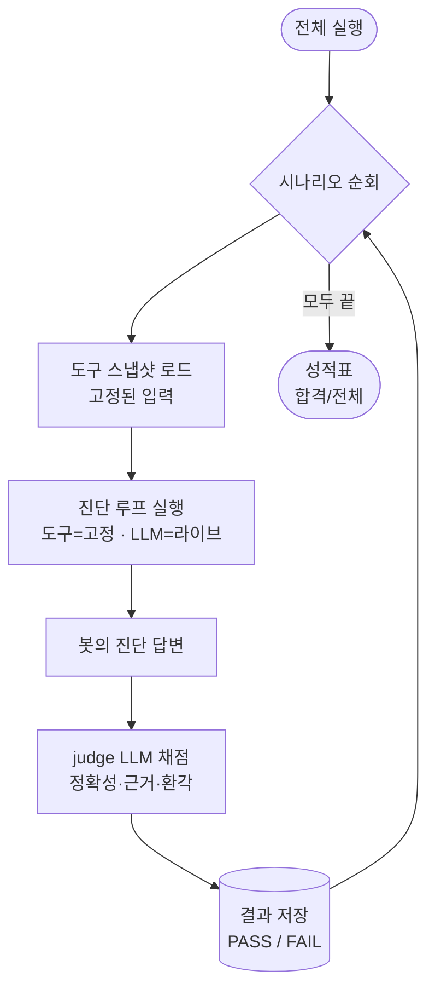
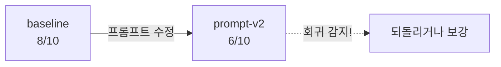

지난 [[zzolbot]] 글에서 운영 동선을 LLM에게 위임한 ZzolBot을 만들었다. 개발자가 "A4BX 방 멈췄어요" 한 줄을 던지면 봇이 도구를 호출해 진단을 돌려준다.

그런데 봇을 며칠 굴리고 나니 더 큰 불안이 생겼다.

**"이 봇이 제대로 진단하는 건 어떻게 보장하지?"**

앞으로 진단 품질을 끌어올리려면 시스템 프롬프트를 손보거나 Gemini 모델을 올리게 될 텐데, 그때마다 같은 질문이 따라붙을 게 뻔했다. 방금 바꾼 게 봇을 더 좋게 만들까, 아니면 조용히 망가뜨릴까?

## 진단봇을 만들고 나서 생긴 더 큰 불안

ZzolBot의 진단은 LLM이 만든다. 그리고 LLM에 의존하는 시스템에는 일반 코드에 없는 약점이 있다.

**프롬프트 한 줄, 모델 버전 하나를 바꾸면 품질이 조용히 나빠져도(회귀) 아무 신호가 없다.** 코드라면 컴파일 에러나 테스트 실패로 잡힌다. 그런데 "outbox를 짚던 봇이 이제 redis만 보고 정상이라 답하는" 식의 품질 저하는 빨간 줄 하나 없이 슬그머니 일어난다.

그런데 지금 내가 가진 검증 수단은 손으로 질문 몇 개 던져보고 "음, 잘 되는 것 같은데?" 눈으로 확인하는 게 전부다. 이건 검증이 아니라 감이다. 진단 순서가 바뀌면 결론까지 달라지는 문제([[zzolbot]]에서 결정론으로 고정했던 그 문제)를 이미 한 번 겪은 터라, 앞으로의 변경을 감에만 맡기는 건 불안했다. 그래서 봇을 본격적으로 손대기 전에 평가 기준부터 만들기로 했다.

문제를 한 문장으로 정리하면 이랬다.

> **봇을 바꿨을 때, 진단 품질이 좋아졌는지 나빠졌는지를 감이 아니라 숫자로 알고 싶다.**

## "잘 되는 것 같다"를 어떻게 점수로 바꿀까

방법을 세 가지 놓고 고민했다.

**대안 1 — 사람이 매번 스팟체크.** 지금 하던 방식이다. 프롬프트를 바꿀 때마다 사람이 질문 몇 개 던져보고 판단한다. 주관적이고, 매번 같은 기준으로 보지 않으며, 무엇보다 회귀를 놓친다. 채택하지 않았다.

**대안 2 — 라이브 시스템에 질문을 던져 채점.** 실제 운영 시스템에 대고 봇을 돌리고 답을 평가하는 방식이다. 문제는 봇이 보는 데이터(Loki 로그, Redis 적재량, DB 상태)가 **매번 변한다**는 것이다. 어제는 "redis 백로그가 원인"이 정답이었는데 오늘은 백로그가 풀려서 같은 질문의 정답이 바뀐다. 입력이 흔들리면 점수도 흔들려서, 프롬프트를 바꾼 효과인지 데이터가 바뀐 효과인지 구분할 수 없다. 비교 도구로는 실격이다.

**대안 3 — 도구 결과만 고정하고, LLM은 라이브로 호출.** 최종 채택안이다.

핵심 통찰은 이거였다. **봇이 바꾸는 건 LLM의 추론이지 데이터가 아니다.** 그러니 평가에서 고정해야 할 건 "입력 데이터"고, 변수로 둬야 할 건 "LLM의 추론"이다.

그래서 시나리오마다 그 질문을 풀 때 봇이 보게 될 **도구 결과를 스냅샷으로 고정(freeze)** 해두고, 평가할 땐 라이브 도구 대신 그 스냅샷을 먹인다. 대신 **LLM(Gemini)은 진짜로 호출**한다. 이러면:

- 입력(도구 데이터)이 고정돼서 **매번 같은 조건** → 점수가 데이터 변동에 안 흔들린다.
- LLM은 라이브라서 **프롬프트/모델을 바꾼 효과가 점수에 그대로 드러난다.**

결국 내가 쥐려던 건 통제가 아니라 비교였다. LLM을 완벽히 길들여 매번 같은 답을 받아내는 건 애초에 불가능하다. 필요한 건 변경 전과 후를 같은 조건에 세워 견주는 것뿐이고, 도구 결과를 고정하는 건 딱 그 비교 가능성을 위한 장치다.

> LLM까지 고정했다면? 그건 완전한 회귀 테스트는 되지만, 정작 내가 알고 싶은 "프롬프트/모델 바꾼 효과"를 볼 수 없다. 그래서 도구만 고정하고 LLM은 살려뒀다.

채점은 **또 다른 LLM(judge)에게 맡겼다.** 사람이 매번 채점하면 결국 대안 1로 돌아간다. 정답을 모범답안 전문으로 적어두는 대신 **채점 기준(rubric) — "정답에 반드시 들어가야 할 핵심"** 한두 줄만 적어두고, judge가 봇 답변에 그 핵심이 있는지로 PASS/FAIL을 매긴다. 라벨링 비용은 최소화하고, 답변의 표현 다양성은 허용하는 절충이다.

## 어떻게 만들었나

평가 하네스는 네 조각으로 이뤄진다 — 시나리오 정의, 입력을 고정하는 replay, judge 채점, 그리고 이들을 잇는 전체 실행 흐름.

### 시나리오 = 질문 + 고정된 도구 결과 + 채점 기준

평가의 단위는 **골든 시나리오**다. 하나의 시나리오는 세 가지로 구성된다.

| 구성 | 무엇 | 누가 |
|---|---|---|
| **질문** | 사람이 던지는 질문 | 사람 |
| **도구 스냅샷** | 그 질문을 풀 때 봇이 보게 될 도구 결과(고정) | 자동(캡처) |
| **채점 기준(rubric)** | 정답에 반드시 들어가야 할 핵심 | 사람 |

예를 들어 "응답이 느려요" 시나리오라면 — 질문은 "요즘 전체적으로 응답이 느려요. 점검해줘", 도구 스냅샷은 `redis_stream_status → {game-stream: 48213}`(백로그), 채점 기준은 "Redis game-stream 백로그를 근본원인으로 짚으면 정답, 정상이라 답하면 오답"이다.

이때 채점 기준은 도구 결과가 "백로그 48213개"일 때만 정답이다. 만약 평가하면서 라이브 Redis를 봐서 백로그가 이미 풀려 있었다면, "정상"이라 답한 봇이 맞는데도 오답 처리된다. **질문과 정답은 한 쌍이라, 그 순간의 도구 결과를 고정해야 채점이 성립한다.**

"무엇이 정답인지"는 도메인을 아는 사람만 판단할 수 있어서 rubric은 사람이 적는다. 하지만 **도구 데이터는 봇이 라이브로 한 번 돌면서 자동으로 고정**되기 때문에, 사람이 손으로 채워야 하는 건 질문과 한두 줄짜리 rubric뿐이다.

### 입력은 고정하고, 추론만 평가한다

가장 까다로운 부분은 "봇이 도구를 호출하면 진짜 시스템 대신 저장해둔 결과를 돌려주는" replay를 기존 진단 루프에 끼워 넣는 일이었다. 진단 코드(`ask`)를 평가용으로 갈아엎고 싶지 않았다. 그래서 **진단 루프가 도구 결과를 얻는 지점만 추상화**했다.

```java
// 도구 "정의"는 항상 그대로 쓰고, 도구 "실행"만 갈아끼운다.
public interface ToolResultSource {
    List<ToolExecutionResult> executeAll(List<ToolCallItem> calls, AskContext ctx);
}
```

- 운영에서는 `ToolExecutor`(실제 도구 실행)가 이 인터페이스를 구현한다.
- 평가에서는 고정된 스냅샷에서 결과를 찾아주는 `SnapshotToolResultSource`를 끼운다.

```java
// 평가용: 라이브 대신 고정된 스냅샷에서 결과를 찾는다.
private ToolExecutionResult resolve(ToolCallItem call) {
    return snapshot.find(call.toolName(), call.args())
            .map(content -> ToolExecutionResult.ok(call.toolName(), content))
            .orElseGet(() -> {
                missingCount++;                 // 스냅샷에 없는 호출 = 커버리지 갭 신호
                return ToolExecutionResult.fail(call.toolName(), "스냅샷에 없는 도구 호출");
            });
}
```

기존 `ask`는 "라이브 실행 + 세션 영속화"로 위임하게만 바꿨다. 컨트롤러도, 운영 동작도 건드리지 않았다. 평가는 같은 진단 루프에 **고정 소스**와 **비영속 sink**만 주입해 돌린다. 덕분에 평가가 운영 진단 이력(`zzolbot_session`)을 오염시키지도 않는다.

여기서 한 가지 흥미로운 신호가 따라온다. 봇이 스냅샷에 없는 도구를 호출하면 `missingCount`가 올라간다. 이건 "이 시나리오가 봇의 실제 행동을 충분히 커버하지 못한다"는 신호라서, 시나리오를 보강할 단서가 된다.

### 채점은 또 다른 LLM에게 맡긴다

봇이 답을 내놓으면, **judge LLM**이 그 답을 rubric과 비교해 채점한다. 채점 결과는 자연어 평이 아니라 구조화된 JSON으로 강제했다.

```json
{
  "accuracy": 5,                  // 정확성 (0~5)
  "groundedness": 4,              // 근거 충실성 — 도구 결과를 실제로 인용했는가 (0~5)
  "hallucinationDetected": false, // 없는 테이블·수치를 지어냈는가
  "verdict": "PASS",              // 종합 합격 여부
  "rationale": "redis game-stream 백로그를 근본원인으로 정확히 짚음"
}
```

세 축으로 나눈 데는 이유가 있다.

- **정확성**: rubric의 핵심을 맞혔는가.
- **근거 충실성**: 답이 도구 결과에 기반했는가. 운 좋게 맞힌 답과 근거로 짚은 답을 구분한다.
- **환각(hallucination)**: 없는 사실·수치를 지어냈는가. 운영봇에서 가장 위험한 실패 모드라 따로 본다.

judge도 결정성을 위해 temperature를 0으로 두고 JSON 응답을 강제했다. 그리고 judge 호출은 진단봇과 레이트리밋이 충돌하지 않도록 별도 인스턴스로 분리했다.

### 전체 흐름

"전체 실행"을 누르면 골든 시나리오 전체가 이 흐름을 탄다.



입력은 스냅샷으로 고정되고, 가운데 진단 LLM만 변수로 남는다. 그래서 프롬프트나 모델을 바꾸고 다시 돌리면, 그 변화가 **성적표의 점수 차이**로 그대로 드러난다.



예를 들어 `baseline 8/10`이던 게 프롬프트를 고친 뒤 `6/10`으로 떨어진다면, **회귀가 숫자로 잡힌다.** 감으로 "잘 되는 것 같은데?" 하던 자리를 점수가 대신하는 그림이다. (아직 프롬프트·모델을 손대진 않았고, 그 변경을 안전하게 하려고 이 평가 기준을 먼저 만든 것이다.)

## 골든셋은 결국 사람이 만든다

평가 하네스의 가장 약한 고리는 "골든셋을 어떻게 채우느냐"다. 정답이 정해진 문제집이 있어야 채점이 의미가 있는데, 그 정답은 도메인을 아는 사람만 안다. (정답을 자동으로 알 수 있다면 애초에 봇이 필요 없다.)

부담을 줄이는 장치를 두 개 뒀다.

**진단 한 번으로 스냅샷 만들기.** 운영자가 실제로 겪은 상황을 봇에게 한 번 진단시키면, 그때 도구가 뱉은 결과가 자동으로 스냅샷으로 고정된다. 사람은 이름과 한두 줄 rubric만 적으면 된다. **한 번 겪은 상황이 그대로 영구 시나리오로 굳는** 셈이다.

**콜드 스타트 시드.** 빈 문제집으로 시작하지 않도록, outbox 백로그·redis 백로그·결제 콜백 NPE·OAuth 401·DB 커넥션 풀 고갈 같은 **전형적 전역 장애 시나리오**를 시드로 미리 깔아뒀다.

여기에도 [[zzolbot]]의 ZzolBot과 같은 철학이 들어간다. ZzolBot이 "좋다고 평가받은 답변이 다음 답변을 만든다"는 자기강화 루프였다면, 평가 하네스는 "실제로 겪은 장애가 다음 회귀 테스트가 된다"는 루프다. 운영에서 마주친 인시던트가 그대로 봇의 안전망으로 쌓인다.

## 실제로 어떻게 쓰나


![[zzolbot-eval-scenarios.png]]
어드민 대시보드에 평가 탭을 붙였다. 시나리오 목록과 채점 기준이 한 화면에 보이고, "전체 실행"을 누르면 백그라운드로 채점이 돈다.


![[zzolbot-eval-run.png]]
실행이 끝나면 `baseline / gemini-2.5-flash / COMPLETED / 5/5` 처럼 성적표 한 줄이 쌓인다. 프롬프트나 모델을 바꿔 라벨을 달리하면, 같은 표에서 버전별 점수를 나란히 비교할 수 있다. 위 화면에서도 `baseline`과 `v2`가 한 표에 올라와 있어, 두 버전을 바로 비교할 수 있다.


![[zzolbot-eval-detail.png]]
성적표의 행을 클릭하면 시나리오별로 **봇이 실제로 뭐라고 답했는지**와 **judge가 왜 그렇게 판정했는지**가 펼쳐진다. 점수만 있으면 "왜 FAIL이지?"를 알 수 없는데, 답변과 판정 근거를 함께 보면 프롬프트를 어디서 손봐야 할지가 바로 보인다.

## 느낀점

평가 하네스를 만들면서 생각이 한 번 바뀐 지점이 있었다.

처음엔 "**재현성** = 같은 질문에 항상 같은 답"이라고 생각했다. 그런데 LLM 위에서 그건 원천적으로 불가능에 가깝다. 라이브 데이터가 변하고, Gemini는 seed를 줘도 완전 결정적이지 않다. 여기에 매달리면 답이 안 나온다.

그래서 재현성의 정의를 바꿨다. **"같은 답이 또 나오게"가 아니라 "두 버전을 같은 조건에서 비교 가능하게".** 도구 결과만 스냅샷으로 고정하니, 완벽한 결정성은 못 얻어도 비교 가능성은 얻었다. 그리고 운영봇을 개선하는 데 실제로 필요했던 건 결정성이 아니라 비교 가능성이었다.

또 하나. ZzolBot을 처음 만들 때 가장 크게 느낀 게 "운영봇에 필요한 건 더 좋은 모델이 아니라 안전한 경계"였는데, 평가 하네스를 만들고 나선 거기에 한 줄이 더 붙었다. **봇을 신뢰하려면, 봇이 제대로 일하는지 측정할 수 있어야 한다.** 진단봇이 "운영을 감시하는 LLM"이라면, 평가 하네스는 "그 LLM이 제대로 감시하는지 감시하는" 장치다.

LLM의 출력을 자연어 인상평이 아니라 **정량 점수로 바꾸는 일** — 이게 운영봇을 감이 아니라 데이터로 개선하게 만든 가장 큰 변화였다.
